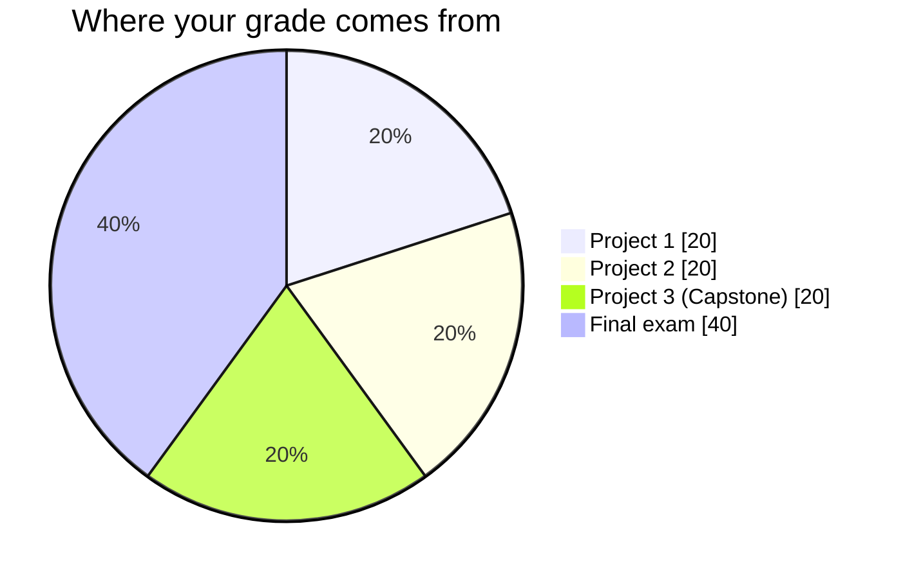
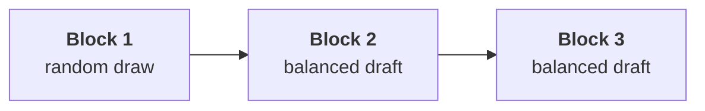
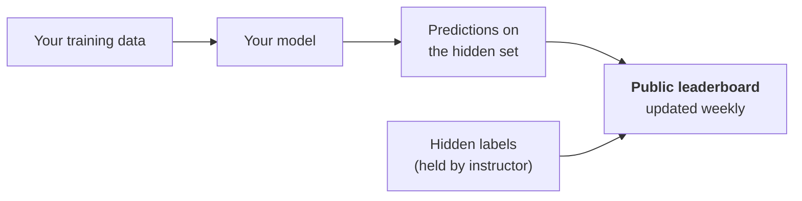

# Assessment & Grading

!!! abstract "At a glance"
    **Total:** 100 points
    **Projects:** 3 team projects, 20 points each, 60 points total
    **Final exam:** 40 points, individual
    **Teams:** 3 people, re-formed at the start of each block
    **Bonus:** up to 5 points from the League

---

## How the 100 points break down

| Component | Points | Mode | Due |
|---|:--:|---|---|
| **Project 1** — Validated baseline | 20 | Team of 3 | End of Week 4 |
| **Project 2** — Model comparison | 20 | Team of 3 | End of Week 9 |
| **Project 3** — Capstone | 20 | Team of 3 | Week 14, presented |
| **Final exam** | 40 | Individual | Exam session |
| **League bonus** | up to +5 | Team | End of semester |

The split is deliberate. Sixty points reward what you can build with other people, which is how the work actually happens. Forty points reward what you understand on your own, which no team can carry for you.

---

## Teams of three

You work in teams of three for all three projects. Teams are **re-formed at the start of each block**, so you work with six different people over the semester.

### How teams are formed

**Block 1** is a random draw, announced in Week 1.

**Blocks 2 and 3** use a balanced draft. Teams are assembled so each one contains a spread of standings from the previous block, not three people from the top. Two consequences worth understanding: nobody gets trapped on a team that is not working, and no team runs away with the League by stacking talent.

!!! note "Why teams rotate"
    Fixed teams settle into roles fast. One person becomes the data person, one the modelling person, one the writer, and by Week 14 each of you has practised one third of the course. Rotation forces you to take a different seat each block.

### Everyone on the team gets the team grade

A project grade is a team grade. All three of you receive it. You win together and you lose together, and that is the point.

There is one adjustment, to make free-riding unprofitable.

### The contribution multiplier

At the end of each project, each team member privately rates their two teammates on contribution. The ratings are averaged into a multiplier applied to that person's project score.

| Peer rating | Multiplier | Effect on 20 points |
|---|:--:|---|
| Carried substantially more | **1.10** | up to 22 |
| Full contribution | **1.00** | 20 |
| Contributed, but less | **0.90** | 18 |
| Largely absent | **0.70** | 14 |

!!! warning "The ratings are not a formality"
    They are anonymous to your teammates, visible to me, and I read all of them. Two things get flagged: a team where everyone rates everyone 1.10 (which tells me nothing and gets reset to 1.00 for everyone), and a pattern where the same person is rated low across two different blocks with two different sets of teammates.

    If a teammate goes genuinely missing, tell me in the week it happens, not in the rating after the deadline. A team of two with notice is fine. A team of two discovered afterwards is not.

### What a team split usually looks like

Not a rule, just what works. Rotate these across the three projects.

| Role | Owns |
|---|---|
| **Data** | Loading, cleaning, splitting, leakage checks |
| **Modelling** | Training, tuning, the experiment log |
| **Delivery** | README, report, figures, the presentation |

Everyone reviews everyone's code. Everyone must be able to explain the whole project, because in the capstone Q&A I ask whoever I like.

---

## The projects

Each project is 20 points, against a published rubric. The weights are roughly the same each time.

| Criterion | Points | What earns them |
|---|:--:|---|
| **Method** | 8 | Correct splitting, no leakage, evaluation that fits the problem |
| **Execution** | 5 | The code runs, the pipeline is reproducible, results are what you claim |
| **Communication** | 4 | README and report a stranger can follow, honest limitations |
| **Craft** | 3 | Repo conventions, commit history, code someone else can read |

!!! tip "Where points are actually lost"
    Almost never on modelling. They are lost on a leaked feature, a repo that will not clone and run, a conclusion the measured variance does not support, and a README written at midnight. Three of those four are entirely within your control before you write a line of model code.

Full criterion-by-criterion rubrics live on the [rubrics page](../05-projects/rubrics.md), published before each project opens.

### Peer review is part of the project

Before each deadline, your team swaps repositories with another team. You clone theirs, follow their README, and try to run it. You submit a short review: what ran, what did not, what you would change.

The review you **give** is graded as part of your Craft points. A review that says "looks good" is worth nothing. A review that finds a leak in someone else's pipeline is worth a lot, to them and to you.

---

## The final exam

Forty points, individual, closed book except for a one-page sheet of notes you write yourself.

| Part | Points | Format |
|---|:--:|---|
| **A. Concepts** | 15 | Short answers. Why, not what. "Your CV score is 0.91 and your test score is 0.62. Give three plausible causes." |
| **B. Code reading** | 15 | You are given a pipeline. Find what is wrong with it and explain the consequence. |
| **C. Judgement** | 10 | A scenario. Choose a metric, a split, and a baseline, and defend all three. |

There is no part asking you to recall an algorithm's formula. The exam tests whether you can diagnose, choose, and justify, which is what the projects have been training for fourteen weeks.

!!! success "How to prepare"
    Reread your own project logs. Almost every exam question resembles something that went wrong in one of your three projects. The teams who keep honest logs find the exam familiar.

---

## The League

Running alongside the grade is a season-based team competition. It is worth up to **5 bonus points** on your final total, and it exists because a project deadline every five weeks is not enough feedback to keep momentum.

Each block is a **season**. Teams earn **League Points (LP)**. LP are not grade points. At the end of the semester, the standings convert to bonus.

### Earning LP

-   :material-trophy:{ .lg .middle } **Season champion**

    ---

    Best overall project in the block, judged on the rubric.

    **+10 LP** · runner-up **+6 LP**

-   :material-speedometer:{ .lg .middle } **Beat the line**

    ---

    Blocks 1 and 2 have a hidden test set. Beat the instructor benchmark and score.

    **+3 LP**

-   :material-check-decagram:{ .lg .middle } **Clean clone**

    ---

    Your reviewing team cloned your repo and it ran first time, no improvising.

    **+3 LP**

-   :material-magnify:{ .lg .middle } **Best review given**

    ---

    The peer review that found the most real problems, not the nicest one.

    **+4 LP**

-   :material-flask-empty-remove:{ .lg .middle } **Honest failure**

    ---

    Best documented negative result. Something you tried, why you expected it to work, why it did not.

    **+3 LP**

-   :material-bug:{ .lg .middle } **Bug bounty**

    ---

    Find a genuine error in these course materials and open an issue on the site repo.

    **+2 LP each**

-   :material-hand-heart:{ .lg .middle } **Assist**

    ---

    Answer a classmate's question in the course channel and have them endorse it.

    **+1 LP each, max 5 per season**

-   :material-flag-checkered:{ .lg .middle } **First blood**

    ---

    First team in the block with a working end-to-end pipeline, however bad the score.

    **+5 LP, once per season**

### Losing LP

!!! danger "Penalties"
    | Situation | LP |
    |---|:--:|
    | Late submission | **-5 per day** |
    | Reviewing team could not run your repo | **-3** |
    | Leaderboard spam, more than 5 hidden-set submissions in a block | **-2 per extra** |
    | Unattributed AI-generated work | **all LP for the season, and see integrity below** |

    The leaderboard penalty is not arbitrary. Submitting repeatedly against a held-out set until something sticks is overfitting to the test set, which is the exact sin this course spends fourteen weeks teaching you to avoid. Five attempts per block is generous.

### The hidden test set

For Projects 1 and 2 I hold back a slice of the data you never see. You submit predictions, a public leaderboard updates, and you find out how your validation held up against data that was genuinely unseen.

!!! note "The leaderboard is not the grade"
    It is worth 3 LP, which is worth a fraction of a bonus point. Your rank on it changes nothing about your 20 points. It exists so that the gap between your cross-validation score and your true generalisation becomes a felt experience rather than a warning on a slide. Teams whose CV was honest tend to find the two numbers close. That lesson is the prize.

### Standings and bonus

Standings are posted after each season and carry over. Final conversion:

| Final position | Bonus to each member |
|---|:--:|
| 1st | **+5 points** |
| 2nd | **+3 points** |
| 3rd | **+2 points** |
| 40 LP or more | **+1 point** |

Since teams re-form each block, your LP travel with you. A player on the season-one champion keeps that LP into a new team. This means strong contributors accumulate regardless of who they are drafted with, and a team is never written off by a bad first block.

Final grades are capped at 100.

---

## Grades

| Points | Grade |
|---|:--:|
| 90 to 100 | **10** |
| 80 to 89 | **9** |
| 70 to 79 | **8** |
| 60 to 69 | **7** |
| 50 to 59 | **6** |
| 40 to 49 | **5** |
| Below 40 | **4** (fail) |

!!! info "Passing requires both halves"
    You need 40 points overall **and** at least 15 of 40 on the final exam. A team cannot carry you to a pass. This is the one place where the individual component is a gate rather than a weight.

---

## Deadlines and lateness

| Project | Opens | Due |
|---|---|---|
| Project 1 | Week 1 | End of Week 4 |
| Project 2 | Week 5 | End of Week 9 |
| Project 3 | Week 10 | Week 14, presented live |

Submission is a GitHub repository, pushed before the deadline. The last commit timestamp is the submission time.

**Late work** loses 2 grade points per day, up to three days, after which it is not accepted. It also costs 5 LP per day. Ask for an extension before the deadline if something real has happened, not after.

---

## Integrity and AI

Collaboration inside your team is the whole design. Collaboration across teams on approach and debugging is encouraged. Copying another team's code, or submitting work you cannot explain, is not.

**The test applies to everyone:** you must be able to explain any line of your team's submission. In the capstone Q&A I choose who answers.

**AI assistants are allowed and expected.** Two conditions, both non-negotiable. Declare where you used them in your README. Understand what they produced. Undeclared AI-generated work costs your team its LP for the season and is handled under university regulations.

The [how to work](how-to-work.md) page covers the reasoning behind both in more detail.

---

## Summary

- **60 points** from three team projects, graded against published rubrics
- **40 points** from an individual exam that tests diagnosis, not recall
- **Teams rotate** every block, so you work with six people, not two
- **Peer ratings** adjust your share, so contribution is visible
- **The League** runs alongside for up to 5 bonus points, and mostly exists to make the feedback loop weekly instead of every five weeks

!!! quote
    The projects measure what you can build with other people. The exam measures what you understand alone. You need both, which is also true of the job.
