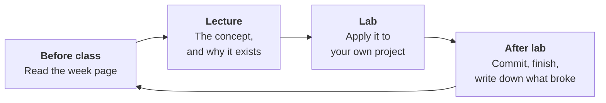

# How to Work in This Course

!!! abstract "The short version"
    You learn by building. Labs are project time, not exercise time. Talk to your peers constantly. Commit small and often. Ask for help after twenty minutes, not after two days.

This page explains the rhythm of the course and how to work inside it. Read it once now, and skim it again at the start of each block.

---

## The rhythm

### Each week

**Before the lecture,** read the week page — twenty minutes, not two hours. You do not need to understand it. You need to arrive with the vocabulary and at least one question.

**In the lecture,** we cover the concept and, more importantly, the problem it exists to solve. Interrupt. A question asked out loud saves eight people the same confusion.

**In the lab,** you apply that week's concept to **your current project**. Not to a toy dataset, not to an exercise sheet. This is the core design decision of the course: by the time a project is due, you have already built most of it in class.

**After the lab,** finish what you started, commit it, and write one line in your project log about what broke and how you fixed it. That log becomes your report later.

### Each block

Four to five weeks, then a project. The project is not a final assignment bolted on at the end — it grows through the block, one lab at a time. If you are starting your project the weekend before it is due, you have misunderstood the format and it will show in the grade.

---

## Project-based learning: what actually changes

!!! info "You will feel behind. That is the format working."
    In a lecture course, understanding comes first and application comes later. Here they arrive together, which means you will regularly be building something you only half understand. The understanding consolidates *through* the building. Sit with the discomfort for a week before concluding you are lost.

**Three things this format asks of you that a normal course does not:**

**You own the problem.** Nobody will hand you a clean dataset and a clear question. You choose, you scope, you defend. This is uncomfortable and it is the entire point — it is exactly what the job is.

**Wrong turns count as work.** A model family you benchmarked that lost, a feature you engineered that hurt, a clustering that found nothing — these are results. Document them. A report that says "we tried X, it failed, here is why" is stronger than one that pretends the first idea worked.

**The deliverable is the whole thing.** Code that runs on your machine only is incomplete. A notebook with no README is incomplete. A great score with no error analysis is incomplete.

---

## Learn by doing: how to actually study this

=== "Do this"

    - **Type the code, don't copy it.** Copying a code block teaches you nothing. Typing it forces you through every line.
    - **Break it on purpose.** Remove the scaler. Fit the encoder on the full dataset. Watch what happens to the score. Deliberately induced failure teaches faster than success.
    - **Predict before you run.** Say out loud what you expect the output to be, then run the cell. Every mismatch is a gap you just found for free.
    - **Rebuild from memory.** A week after a lab, redo it from scratch without looking. What you cannot reproduce, you did not learn.
    - **Explain it to someone.** If you cannot explain cross-validation to a classmate in two minutes, you do not understand cross-validation.

=== "Not this"

    - **Watching tutorials as a substitute for building.** Passive video feels productive and is not.
    - **Reading the whole week page carefully before class.** Skim it. Depth comes from the lab.
    - **Tuning hyperparameters to chase a score.** In this course that is the *last* thing you do and the least of your marks.
    - **Starting with the fanciest model.** If you have not beaten the baseline, gradient boosting will not save you.
    - **Saving all your commits for one big push.** You lose your own history, and so do we.

!!! tip "The twenty-minute rule"
    Stuck on the same error for twenty minutes with no new information? Stop. Ask a classmate, post in the course channel, or ask me. Struggling productively is learning; staring at the same traceback is not. Twenty minutes is the line.

---

## Working with your peers

You are not competing with each other. There is no curve, and one person understanding something well makes the whole room faster.

-   :material-account-multiple:{ .lg .middle } **Pair on hard parts**

    ---

    One drives, one navigates, swap every twenty minutes. Especially good for debugging pipelines and reading unfamiliar library docs.

-   :material-comment-search:{ .lg .middle } **Review each other's code**

    ---

    Before each project deadline, swap repos with one classmate. Can they run it from the README alone? If not, neither can I.

-   :material-duck:{ .lg .middle } **Explain it out loud**

    ---

    Describe your problem to someone, line by line. You will solve it mid-sentence about half the time.

-   :material-help-circle:{ .lg .middle } **Ask in public**

    ---

    Use the course channel rather than DMs. Your question is someone else's question, and the answer stays searchable.

### Where the line is

Collaboration is expected. Submitting someone else's work is not. The line is straightforward:

| Fine | Not fine |
|---|---|
| Discussing approaches, debugging together, explaining a concept | Sharing project code to be copied |
| Using a classmate's *idea* with acknowledgement in your report | Submitting a pipeline you cannot explain line by line |
| Reading public code and citing it | Presenting someone else's analysis as yours |

The practical test: **you must be able to defend every line of what you submit.** In the capstone Q&A, you will be asked to.

### On AI assistants

Use them. They are part of the job now, and pretending otherwise would be dishonest teaching.

Two conditions. **Declare it** — a short note in your project README saying where you used AI and for what. **Understand it** — if you cannot explain a piece of generated code, do not submit it. An AI that writes your pipeline while you learn nothing has cost you the only thing you came here for.

They are genuinely good at boilerplate, syntax you half-remember, and explaining errors. They are unreliable on exactly the things this course grades: whether your split is right, whether your metric fits the problem, whether your conclusion survives the variance. Do that part yourself.

---

## Habits that compound

!!! success "Adopt these in Week 1, not Week 10"

    **Commit small, commit often.** One logical change per commit, with a message that says what changed. Your git history becomes the story of your project, and you will read it when writing your report.

    **Keep a project log.** One markdown file. Every session: what you tried, what happened, what you decided. Ten minutes a week that turns into your report for free.

    **Set seeds everywhere.** `random_state` on every split, every model, every shuffle. Unreproducible results are not results.

    **Write the README as you go.** If it is not written by the deadline, it is written badly.

    **Never work on a branch you cannot rebuild.** If deleting your `data/` folder would destroy your project, your project is not reproducible. The pipeline should rebuild everything from the raw source.

---

## Getting unstuck

When something breaks, in this order:

1. **Read the actual error.** All of it, bottom line first. Python tracebacks are more informative than people expect.
2. **Find the smallest failing case.** Cut rows, cut columns, cut steps until it either works or you have isolated the break.
3. **Print the shapes.** A surprising share of ML bugs are shape mismatches wearing a costume.
4. **Check the obvious three.** Did you fit on the right split? Are your types what you think they are? Are there NaNs?
5. **Search the exact error text.** In quotes, without your variable names.
6. **Ask.** With: what you were trying to do, what you expected, what happened, and what you already tried.

---

## Time budget

Roughly, per week, outside class:

| Activity | Hours |
|---|:--:|
| Reading the week page | 0.5 |
| Finishing the lab | 1–2 |
| Project work | 2–3 |
| **Total** | **4–5** |

This rises in the weeks before a deadline and in the capstone block. If you are consistently spending much more than this, come talk to me — it usually means something specific is blocking you and it is fixable.

---

## What good work looks like

!!! example "A strong submission"
    - Clones and runs from the README with no undocumented steps
    - Has a baseline, and the model is compared against it
    - States the metric *and* why that metric fits the problem
    - Reports variance, not just a single number
    - Names its own limitations before I have to
    - Includes the things that failed

!!! failure "A weak submission"
    - A notebook with no narrative and no README
    - A high score with no explanation of the validation setup
    - A conclusion the measured variance does not support
    - Hard-coded paths, no seeds, cells run out of order
    - Nothing about what did not work

The gap between these two is almost never technical ability. It is discipline and documentation, and both are entirely within your control.

---

!!! quote
    You are not here to learn algorithms. You are here to become the person who can be trusted with a messy problem and real data. Build things, break them, write down what you learned, and repeat it eleven more times.
