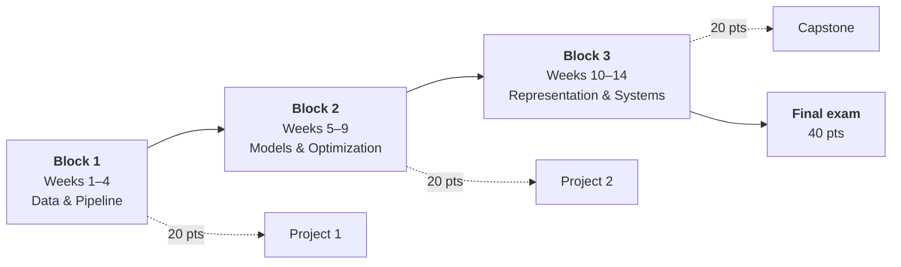

# Course Overview

Machine Learning, third year, Bachelor. Fourteen weeks, three team projects, one exam, and a running competition.

This section holds everything about how the course works. Read all three pages in the first week and you will not have to ask an administrative question again.

---

## Quick facts

| | |
|---|---|
| **Programme** | Bachelor, Year 3, University Metropolitan Tirana |
| **Duration** | 14 weeks, one lecture and one lab each week |
| **Format** | Project-based, teams of three |
| **Assessment** | 3 projects at 20 points, exam at 40 points, up to 5 bonus |
| **Prerequisites** | Python, basic statistics, introductory programming |
| **Instructor** | Evis Plaku |

---

## Start here

-   :material-map-marker-path:{ .lg .middle } **Syllabus & the 14-week path**

    ---

    What you learn, week by week, and what each week lets you do that you could not do before. The full arc in one page.

    [:octicons-arrow-right-24: See the path](syllabus.md)

-   :material-scale-balance:{ .lg .middle } **Assessment & grading**

    ---

    How the 100 points work, how teams are formed and rated, and the rules of the League.

    [:octicons-arrow-right-24: See the rules](assessment.md)

-   :material-compass-outline:{ .lg .middle } **How to work in this course**

    ---

    The weekly rhythm, how to study by building, working with your peers, and getting unstuck fast.

    [:octicons-arrow-right-24: Read this early](how-to-work.md)

-   :material-tools:{ .lg .middle } **Toolkit**

    ---

    Python, Git, VS Code, and the refreshers. Do this before Week 1 or you will spend your first lab on installers.

    [:octicons-arrow-right-24: Set up](../01-toolkit/index.md)

---

## The shape of the semester

Three blocks, each ending in a project. New teams at the start of each one. The exam at the end is individual and tests whether the team work actually landed in your head.

---

## Key dates

| Week | What happens |
|:--:|---|
| **1** | Teams drawn, Project 1 opens |
| **4** | Peer review, then Project 1 due |
| **5** | Teams re-drafted, Project 2 opens |
| **9** | Peer review, then Project 2 due |
| **10** | Teams re-drafted, capstone opens, problem framing approved |
| **14** | Capstone presentations, League standings final |
| **Exam session** | Final exam |

---

## Where to get help

-   :material-forum:{ .lg .middle } **Course channel**

    ---

    First stop for anything technical. Ask in public, not in DMs. Your question is someone else's too, and answering earns League points.

-   :material-account-question:{ .lg .middle } **Office hours**

    ---

    For anything that needs a conversation: scoping a capstone, a team that is not working, or a concept that will not click.

-   :material-book-open-page-variant:{ .lg .middle } **Reference section**

    ---

    Linear algebra, calculus, probability, and cheatsheets, all in one place to return to.

    [:octicons-arrow-right-24: Reference](../06-reference/index.md)

!!! tip "The twenty-minute rule applies from day one"
    Stuck on the same error for twenty minutes with no new information? Stop and ask. Struggling productively is learning. Staring at the same traceback is not.

---

## Three things to do this week

- [ ] Finish the [toolkit setup](../01-toolkit/index.md) and pass its readiness checklist
- [ ] Read [how to work in this course](how-to-work.md), properly rather than skimmed
- [ ] Skim the [syllabus](syllabus.md) so you know where the semester is going

---

**Next:** [Week 1, Problem framing and baselines](../02-data-pipeline/week-01-problem-framing.md)
