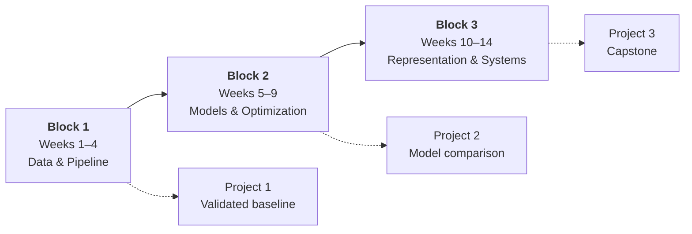

# Syllabus & the 14-Week Path

!!! abstract "At a glance"
    **Programme:** Bachelor, Year 3 — University Metropolitan Tirana
    **Duration:** 14 weeks · one lecture + one lab per week
    **Format:** Project-based — you build three portfolio projects, not three exam answers
    **Assessment:** 85% projects, 15% labs and participation
    **Prerequisites:** Python, basic statistics, introductory programming

---

## What this course is

Most machine learning courses teach you to call `.fit()`. You can already do that.

What this course teaches is everything around it: how to turn a vague request into a learning problem, how to tell whether your data will support it, how to know if your model is actually good or just leaking the answer, and how to put it somewhere other people can use it.

!!! quote "The one commitment"
    **The pipeline is the deliverable, not the model.** A model that scores 95% because it saw the test set is worth less than a model that scores 71% and you can defend.

---

## What you leave with

Three finished projects in a public GitHub portfolio, and the following, in your hands rather than in your notes:

-   :material-target:{ .lg .middle } **Frame a problem**

    ---

    Turn "we want AI to help with X" into a target variable, a metric, and a baseline that tells you whether ML is even worth it.

-   :material-database-check:{ .lg .middle } **Trust your data**

    ---

    Split correctly, spot leakage before it flatters you, and make defensible decisions about missing and broken values.

-   :material-scale-balance:{ .lg .middle } **Evaluate honestly**

    ---

    Choose a metric that reflects the real cost of being wrong, and say which performance differences are real and which are noise.

-   :material-cog-sync:{ .lg .middle } **Understand the machinery**

    ---

    Know what gradient descent is doing, why regularization helps, and why boosting still beats neural networks on tabular data.

-   :material-shape-outline:{ .lg .middle } **Work without labels**

    ---

    Cluster, reduce dimensions, and find structure — plus the harder skill of validating any of it.

-   :material-rocket-launch:{ .lg .middle } **Ship it**

    ---

    Serialize a pipeline, serve predictions behind an API, and explain individual predictions to someone who isn't you.

---

## The path

Each block ends with a project. Each project is harder than the last and less scaffolded than the last. By the capstone you choose your own problem.

---

## :material-database-cog: Block 1 · Data & the Pipeline

**Weeks 1–4** · *A model is the easy part.*

You spend the first four weeks not really modelling. That is deliberate. Everything that goes wrong in a real ML project goes wrong here, and it goes wrong silently — a bad split or a leaked feature doesn't throw an error, it hands you a great score and a broken system.

| Week | Topic | After this week you can | Why it matters |
|:--:|---|---|---|
| **01** | Problem framing & baselines | Define a target, a metric, and a dumb baseline before writing model code | Stops you from building the wrong thing beautifully |
| **02** | Data quality & splitting | Choose the right split — random, stratified, grouped, temporal — and explore *only* the training data | The single most common cause of models that work in a notebook and fail in production |
| **03** | Feature engineering | Build a `Pipeline` where preprocessing is fitted on train only, and encode, scale, and derive features correctly | Good features beat clever algorithms; a leaky pipeline beats nothing at all |
| **04** | Evaluation & error analysis | Pick a metric that matches the cost of error, and find *where* your model fails, not just how often | You cannot improve what you cannot measure honestly |

!!! example "Project 1 — Raw data to a validated baseline"
    **Due end of Week 4 · 20% of final grade**

    A messy real dataset. Simple models only: logistic regression and a decision tree.

    **You deliver:** a reproducible pipeline, a documented split and CV protocol, a baseline comparison, error analysis by data slice, and a short model card.

    **Graded on:** methodological honesty. A well-documented mediocre model scores above an unexplained good one.

---

## :material-chart-bell-curve: Block 2 · Models & Optimization

**Weeks 5–9** · *Understand what the fitting procedure is actually doing.*

Now the models. The goal is not to memorise algorithms but to understand the two or three ideas that generate all of them: a loss function, a way to minimise it, and a penalty that stops you from minimising it too well.

| Week | Topic | After this week you can | Why it matters |
|:--:|---|---|---|
| **05** | Linear models & the loss landscape | Derive linear and logistic regression from the loss up, and interpret coefficients without over-claiming | The base case every other model is a variation on — and where the linear algebra pays off |
| **06** | Optimization | Implement gradient descent, diagnose why it diverges or stalls, and explain what Adam fixes | This is the engine under every model you will ever train, including deep networks |
| **07** | Bias, variance & regularization | Read a learning curve, and use ridge / lasso / early stopping for the right reason | The difference between a model that memorises and one that generalises |
| **08** | Tree-based models | Tune gradient boosting and know when it beats a neural network | The default winner on tabular data — which is most real business data |
| **09** | Model selection & calibration | Run nested CV, calibrate probabilities, and handle class imbalance | Tuning on the test set is the most respectable-looking way to lie with data |

!!! example "Project 2 — A defensible model comparison"
    **Due end of Week 9 · 30% of final grade**

    A harder dataset, different domain from Project 1.

    **You deliver:** a benchmark of at least four model families with an equal, documented tuning budget; variance reported across folds; an explicit claim about which differences are real; and a short technical report in the shape of a workshop paper.

    **Graded on:** the quality of the argument. Your conclusions must be supported by the variance you measured.

---

## :material-graph-outline: Block 3 · Representation & Systems

**Weeks 10–14** · *Unlabeled data, learned representations, and shipping.*

Real data mostly has no labels, and a model that lives only in your notebook has no value. The last block covers both, and hands off cleanly to your Deep Learning course.

| Week | Topic | After this week you can | Why it matters |
|:--:|---|---|---|
| **10** | Clustering | Cluster three ways and defend your choice of *k* without ground truth | Segmentation, anomaly detection, and exploration all start here |
| **11** | Dimensionality reduction | Run PCA via SVD and read a t-SNE plot without being fooled by it | Compression, visualization, and the second half of the linear algebra payoff |
| **12** | Bridge to neural networks | Build an MLP as stacked linear models and say honestly when it beats boosting | The clean handoff into your Deep Learning course |
| **13** | ML systems & responsibility | Serve a model behind an API, detect drift, and explain a single prediction with SHAP | The gap between "trained a model" and "delivered value" |
| **14** | Synthesis & presentations | Present a complete system and defend its design under questioning | The skill that decides whether your work is adopted |

!!! tip "Optional extension in Week 13"
    Wrap your trained model as a tool an LLM agent can call, so the agent handles routing and the natural-language interface. Entirely optional — but it is the single thing most likely to make your capstone stand out in a portfolio.

!!! example "Project 3 — Capstone"
    **Opens Week 10 · presented Week 14 · 35% of final grade**

    Your own problem, end to end.

    **You deliver:** an approved problem framing, a full pipeline, an appropriate evaluation protocol, a deployed inference endpoint, a written report, and a live presentation with Q&A.

    **Graded on:** completeness of the system and the clarity of the argument for its design.

---

## Assessment

| Component | Weight | Due |
|---|:--:|---|
| Project 1 — Validated baseline | 20% | End of Week 4 |
| Project 2 — Model comparison | 30% | End of Week 9 |
| Project 3 — Capstone | 35% | Week 14 (presented) |
| Labs & participation | 15% | Continuous |

Project 1 carries real weight on purpose: methodological sloppiness in Week 4 should cost you something. The capstone carries the most because it is the thing you will actually show people.

!!! info "Rubrics are published in advance"
    Every project is graded against a criterion-by-criterion rubric you can read before you start. See **[Rubrics](../05-projects/rubrics.md)**.

---

## What this course does not cover

Deliberate omissions, so you know where to look instead:

- **Deep learning architectures** — CNNs, RNNs, transformers. Covered in your Deep Learning course; Week 12 is the bridge to it.
- **Big data engineering** — Spark, distributed training, data warehousing. Adjacent discipline.
- **Reinforcement learning** — mentioned in Week 1 for the map, not taught.

---

## Before Week 1

!!! warning "Do this in the first days, not in Week 3"
    - [ ] Working Python environment — see **[Environment setup](../01-toolkit/environment-setup.md)**
    - [ ] GitHub account, and you can push to a repo from your machine
    - [ ] Comfortable with pandas dataframes and NumPy arrays — see **[NumPy & pandas refresher](../01-toolkit/numpy-pandas.md)**
    - [ ] Read **[How to work in this course](how-to-work.md)** — it explains the rhythm and will save you time

---

!!! quote
    Start simple, measure honestly, and improve in small steps. A clear baseline plus good metrics beats a clever algorithm every time.
