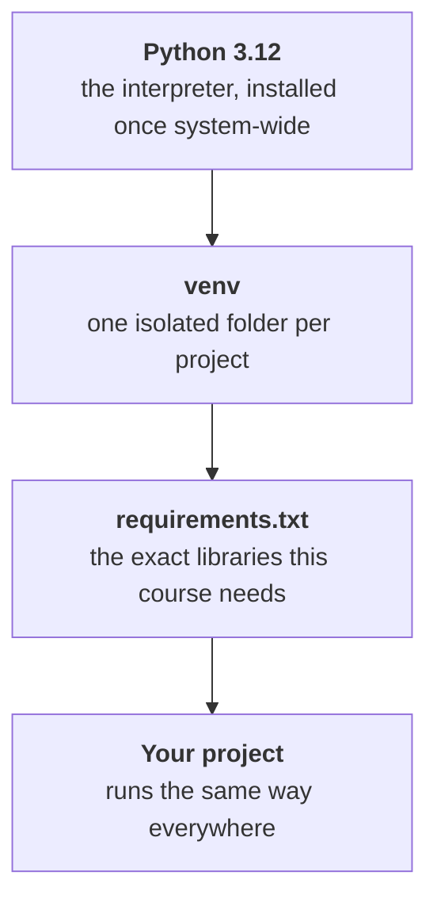

# Environment Setup

!!! abstract "At a glance"
    **Estimated time:** 45 minutes
    **You need:** a laptop, admin rights, an internet connection
    **You end with:** Python, an isolated project environment, and every library this course uses
    **Do this before:** Week 1

## Why this matters

> "It works on my machine" is the oldest excuse in software, and it is never accepted.

Every project you submit in this course has to run on someone else's computer. Mine, a classmate's during peer review, or a GitHub Actions runner. If it only runs on yours, it is incomplete work, no matter how good the model is.

There is a second reason, less obvious but more painful. Python libraries move fast. A notebook written against scikit-learn 1.3 can break on 1.7 without warning. If you install everything globally, your Week 12 project can silently break your Week 3 project, and you will lose an evening finding out why. Isolated environments stop this from happening.

The habit costs you five minutes per project. Skipping it costs you a weekend, usually the weekend before a deadline.

## What you are installing



Four pieces. Python itself is installed once on your machine. Everything after that lives inside your project folder and travels with it.

## Step 1: Install Python

You want Python 3.12. Anything from 3.10 upward will work, but the course materials are tested on 3.12.

First, check whether you already have it.

=== ":material-microsoft-windows: Windows"

    Open PowerShell and run:

    ```powershell
    python --version
    ```

    If you see `Python 3.12.x`, skip to Step 2.

    If you see nothing, an error, or a version below 3.10, download the installer from [python.org/downloads](https://www.python.org/downloads/).

    !!! warning "The one checkbox that matters"
        On the first screen of the installer, tick **"Add python.exe to PATH"** before clicking Install. It is easy to miss and it is the cause of roughly half of all Windows setup problems. If you forget, rerun the installer and choose Modify.

    Close PowerShell, open a new one, and check again.

=== ":material-apple: macOS"

    Open Terminal and run:

    ```bash
    python3 --version
    ```

    macOS ships with an old Python that you should leave alone. Install a current one with [Homebrew](https://brew.sh):

    ```bash
    brew install python@3.12
    ```

    If you do not have Homebrew, the installer from [python.org/downloads](https://www.python.org/downloads/) works just as well.

=== ":material-linux: Linux / WSL"

    ```bash
    python3 --version
    ```

    On Ubuntu or Debian, install what you need with:

    ```bash
    sudo apt update
    sudo apt install python3 python3-venv python3-pip -y
    ```

    The `python3-venv` package is separate on Ubuntu and is easy to forget. Without it, creating an environment fails with a confusing message about `ensurepip`.

!!! tip "Anaconda is fine too"
    If you already use Anaconda or Miniconda, you can keep it. Create environments with `conda create -n ml-course python=3.12` instead of the `venv` commands below, and activate with `conda activate ml-course`. Everything else in this course works the same way. Just do not mix the two systems in the same project folder.

## Step 2: Create your project folder

Pick somewhere sensible and stay consistent. A single `projects` folder in your home directory saves you from hunting later.

```bash
mkdir -p ~/projects/ml-project-1
cd ~/projects/ml-project-1
```

On Windows PowerShell:

```powershell
mkdir $HOME\projects\ml-project-1
cd $HOME\projects\ml-project-1
```

!!! warning "WSL users, read this"
    If you are working in WSL, keep your project inside the Linux filesystem (`~/projects/...`), not on the Windows side (`/mnt/c/Users/...`). Crossing the boundary makes file operations several times slower, breaks live reload in some tools, and occasionally corrupts virtual environments. VS Code opens WSL folders natively, so you lose nothing.

## Step 3: Create and activate a virtual environment

A virtual environment is a folder holding its own copy of Python and its own libraries. Nothing inside it can affect anything outside it.

```bash
python3 -m venv .venv
```

On Windows, use `python` instead of `python3`.

That creates a `.venv` folder in your project. Now activate it:

=== ":material-microsoft-windows: Windows"

    ```powershell
    .venv\Scripts\Activate.ps1
    ```

    If PowerShell refuses with a message about execution policies, run this once and try again:

    ```powershell
    Set-ExecutionPolicy -Scope CurrentUser -ExecutionPolicy RemoteSigned
    ```

=== ":material-apple: macOS / :material-linux: Linux / WSL"

    ```bash
    source .venv/bin/activate
    ```

You know it worked when your prompt gains a `(.venv)` prefix:

```console
(.venv) evis@laptop:~/projects/ml-project-1$
```

!!! note "Activation is per terminal session"
    Close the terminal and the environment deactivates. Open a new one and you have to activate again. This catches everyone at least once, usually right after a "why is pandas suddenly not installed" moment. VS Code does it automatically once configured, which is covered in the [VS Code and Jupyter](vscode-jupyter.md) page.

    To leave an environment on purpose, type `deactivate`.

## Step 4: Install the course libraries

Create a file called `requirements.txt` in your project folder with this content:

```text title="requirements.txt"
# Core
numpy>=1.26
pandas>=2.2
scipy>=1.13

# Modelling
scikit-learn>=1.5

# Visualization
matplotlib>=3.9
seaborn>=0.13

# Notebooks
jupyter>=1.1
ipykernel>=6.29
```

Then install everything at once:

```bash
python -m pip install --upgrade pip
python -m pip install -r requirements.txt
```

The first install takes a few minutes. Later ones are faster because pip caches downloads.

??? tip "Libraries added later in the course"
    You do not need these yet. They arrive with the weeks that use them, and you add them to `requirements.txt` when they do.

    | Week | Add | For |
    |:--:|---|---|
    | 08 | `xgboost`, `lightgbm` | Gradient boosting |
    | 09 | `optuna` | Hyperparameter search |
    | 13 | `shap` | Model explanations |
    | 13 | `fastapi`, `uvicorn` | Serving predictions |

!!! danger "Always use `python -m pip`, not bare `pip`"
    `python -m pip` guarantees you are installing into the interpreter you are actually using. Bare `pip` can point somewhere else entirely, which produces the deeply confusing situation where the install succeeds and the import still fails.

## Step 5: Verify it works

Create a file called `check_setup.py`:

```python title="check_setup.py"
import sys
import importlib

REQUIRED = ["numpy", "pandas", "scipy", "sklearn", "matplotlib", "seaborn"]

print(f"Python {sys.version.split()[0]}")
print(f"Interpreter: {sys.executable}\n")

missing = []
for name in REQUIRED:
    try:
        module = importlib.import_module(name)
        version = getattr(module, "__version__", "unknown")
        print(f"  ok      {name:<12} {version}")
    except ImportError:
        print(f"  MISSING {name}")
        missing.append(name)

print()
if missing:
    print(f"Install these: python -m pip install {' '.join(missing)}")
else:
    print("Environment is ready.")
```

Run it:

```bash
python check_setup.py
```

You should see something like this:

```console
Python 3.12.3
Interpreter: /home/evis/projects/ml-project-1/.venv/bin/python

  ok      numpy        2.1.3
  ok      pandas       2.2.3
  ok      scipy        1.14.1
  ok      sklearn      1.5.2
  ok      matplotlib   3.9.2
  ok      seaborn      0.13.2

Environment is ready.
```

Check the interpreter path. It should contain `.venv`. If it points to a system Python instead, your environment is not active and the libraries you just installed went somewhere else.

## Your project skeleton

Every project in this course starts from the same shape. Create it now so it becomes automatic.

```text
ml-project-1/
├── .venv/              # environment, never committed
├── data/
│   ├── raw/            # original files, never edited
│   └── processed/      # generated, never committed
├── notebooks/          # exploration
├── src/                # reusable code
├── models/             # saved models, never committed
├── reports/
│   └── figures/
├── .gitignore
├── requirements.txt
└── README.md
```

```bash
mkdir -p data/raw data/processed notebooks src models reports/figures
touch README.md
```

!!! note "Why raw data is never edited"
    Your pipeline should be able to rebuild everything in `processed/` from what is in `raw/`, with one command. That is what makes a project reproducible. The moment you hand-edit a raw CSV, you have created a step nobody can repeat, including future you. The [repo conventions](repo-conventions.md) page covers this in more detail.

## Common problems

!!! failure "Things that go wrong, and why"

    **`python: command not found` on Windows.** PATH was not set during install. Rerun the installer, choose Modify, tick the PATH box.

    **`ModuleNotFoundError` for something you definitely installed.** The environment is not active, or you installed with a different interpreter. Run `python -c "import sys; print(sys.executable)"` and check the path contains `.venv`.

    **`Activate.ps1 cannot be loaded` on Windows.** PowerShell execution policy. Run the `Set-ExecutionPolicy` command from Step 3.

    **`ensurepip is not available` on Ubuntu.** The venv package is missing. `sudo apt install python3-venv`.

    **pip installs are very slow or time out.** Usually a network issue. Try `python -m pip install -r requirements.txt --timeout 120`.

    **Everything works in the terminal but not in VS Code.** VS Code is using a different interpreter. Fix covered in [VS Code and Jupyter](vscode-jupyter.md).

## Quick reference

| Task | Command |
|---|---|
| Check Python version | `python --version` |
| Create environment | `python -m venv .venv` |
| Activate (Linux, macOS, WSL) | `source .venv/bin/activate` |
| Activate (Windows) | `.venv\Scripts\Activate.ps1` |
| Leave environment | `deactivate` |
| Install from file | `python -m pip install -r requirements.txt` |
| Install one package | `python -m pip install seaborn` |
| List what is installed | `python -m pip list` |
| Freeze exact versions | `python -m pip freeze > requirements.txt` |
| Find the active interpreter | `python -c "import sys; print(sys.executable)"` |

## Summary and next steps

You now have Python installed once, a virtual environment that isolates this project from every other one, the libraries the course runs on, and a folder structure you will reuse all semester.

**Three habits worth keeping:**

- **One environment per project.** Five minutes each time, and version conflicts stop existing.
- **`requirements.txt` stays current.** Every time you install something new, add it. Your project is only reproducible if the list is complete.
- **Check the interpreter path when something is odd.** It explains most setup confusion in one line of output.

**Next:** [Git and GitHub](git-and-github.md), where you learn to track this project properly and get it onto GitHub.

## Resources

- [Python venv documentation](https://docs.python.org/3/library/venv.html) for the official reference
- [pip user guide](https://pip.pypa.io/en/stable/user_guide/) for anything about installing packages
- [Real Python: virtual environments](https://realpython.com/python-virtual-environments-a-primer/) for a longer walkthrough with more detail on how they work internally

!!! quote
    An environment you can rebuild from a text file is worth more than one you spent hours perfecting by hand.
