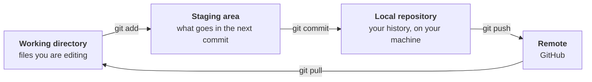
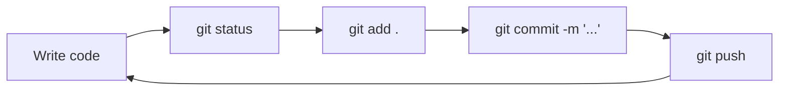

# Git & GitHub

!!! abstract "At a glance"
    **Estimated time:** 60 minutes
    **You need:** a finished [environment setup](environment-setup.md), a GitHub account
    **You end with:** a project tracked in Git, pushed to GitHub, with a sensible history
    **Do this before:** Week 1

## Why this matters

> Your grade is not the model. Your grade is the repository.

Every project in this course is submitted as a GitHub repository. Not a zip file, not a notebook attached to an email. That is not an arbitrary preference. A repository shows the work, not just the result: when you tried something, what you changed, what you abandoned. During peer review a classmate clones your repo and runs it. If that fails, so does the review.

There is also the ordinary reason. Git is the undo button for entire projects. It lets you try a risky refactor knowing you can get back, work on two ideas in parallel without them touching, and answer "what did I change since Tuesday" precisely instead of by memory.

And after the course, your GitHub profile is the first thing anyone hiring you will open. Three well-documented projects there are worth more than the transcript.

## The mental model

Git moves your work through four places. Almost every command you will ever run is about moving something from one to the next.



The staging area is the part that confuses people at first. It exists so you can choose what goes into a commit. You might have changed five files but only two of them belong together as one logical change. Staging lets you commit those two and leave the rest for later.

## Step 1: Install and configure

=== ":material-microsoft-windows: Windows"

    Download [Git for Windows](https://git-scm.com/download/win). Accept the defaults during installation, they are sensible.

    This also gives you Git Bash, a terminal where Linux commands work. Use it when course material shows bash commands.

=== ":material-apple: macOS"

    ```bash
    brew install git
    ```

    Or just run `git --version`, which prompts macOS to install the developer tools if Git is missing.

=== ":material-linux: Linux / WSL"

    ```bash
    sudo apt update && sudo apt install git -y
    ```

Confirm it landed:

```bash
git --version
```

Now tell Git who you are. This is stamped on every commit you make, so do it once, before your first commit.

```bash
git config --global user.name "Your Name"
git config --global user.email "your.email@example.com"
```

!!! tip "Use the email attached to your GitHub account"
    If the commit email does not match a verified email on your GitHub account, your commits will not be linked to your profile. They still work, they just show up as an anonymous contributor, which is a shame when the point is to build a portfolio.

Two more settings that save trouble later:

```bash
git config --global init.defaultBranch main
git config --global pull.rebase false
```

## Step 2: Turn your project into a repository

From inside your project folder:

```bash
cd ~/projects/ml-project-1
git init
```

Before you commit anything, write a `.gitignore`. This tells Git what to leave alone, and getting it right at the start saves you from committing a 400 MB dataset that then lives in your history forever.

```text title=".gitignore"
# Environment
.venv/
venv/
__pycache__/
*.py[cod]

# Data: link to it, do not commit it
data/raw/*
data/processed/*
!data/raw/.gitkeep
!data/processed/.gitkeep

# Models are generated, not authored
models/*
!models/.gitkeep

# Notebooks
.ipynb_checkpoints/

# Secrets
.env
*.key

# OS and editor
.DS_Store
Thumbs.db
.vscode/settings.json
```

The `!` lines are exceptions. They keep the empty folders in the repo so the structure survives, while ignoring their contents.

```bash
touch data/raw/.gitkeep data/processed/.gitkeep models/.gitkeep
```

!!! danger "Two things that must never reach GitHub"
    **Data.** Datasets are large, often licensed, and sometimes contain personal information. Document where the data came from in your README and let the pipeline download or load it. Never commit the files.

    **Secrets.** API keys, tokens, passwords. Once pushed, treat a secret as compromised even if you delete it a minute later, because it is in the history and in GitHub's caches. Keys belong in a `.env` file that `.gitignore` excludes.

## Step 3: Your first commit

```bash
git add .
git commit -m "Initial project structure"
```

Look at what happened:

```bash
git log --oneline
git status
```

`git status` is the command you will run most. It tells you what has changed, what is staged, and what Git is ignoring. When you are confused about the state of anything, start there.

## Step 4: Connect to GitHub

Create an empty repository on [github.com](https://github.com). Do not add a README, a `.gitignore`, or a licence, since you already have those locally and the extra files just cause a conflict on the first push.

Then connect and push:

```bash
git remote add origin https://github.com/YOUR-USERNAME/ml-project-1.git
git push -u origin main
```

### Authentication

GitHub stopped accepting account passwords for Git operations. You have two options.

=== "Personal access token (simpler)"

    Generate one at **GitHub → Settings → Developer settings → Personal access tokens → Tokens (classic)**. Give it the `repo` scope and an expiry you can live with.

    When Git asks for a password, paste the token instead. To avoid retyping it every time:

    ```bash
    git config --global credential.helper store
    ```

    On Windows, Git Credential Manager handles this automatically and more securely.

    !!! warning
        `credential.helper store` writes the token to a plain text file in your home directory. Acceptable on your own machine, a bad idea on a shared one.

=== "SSH key (better long term)"

    Generate a key:

    ```bash
    ssh-keygen -t ed25519 -C "your.email@example.com"
    ```

    Press Enter through the prompts. Then copy the public key:

    ```bash
    cat ~/.ssh/id_ed25519.pub
    ```

    Paste it into **GitHub → Settings → SSH and GPG keys → New SSH key**. Test it:

    ```bash
    ssh -T git@github.com
    ```

    With SSH, the remote URL uses a different form:

    ```bash
    git remote set-url origin git@github.com:YOUR-USERNAME/ml-project-1.git
    ```

!!! failure "`Permission denied (publickey)`"
    This specific error means your remote is set to the SSH form but you have no key configured. Either add a key as above, or switch the remote to HTTPS:

    ```bash
    git remote set-url origin https://github.com/YOUR-USERNAME/ml-project-1.git
    ```

## Step 5: The daily loop

This is what you will actually do, most days, for the rest of the course.



```bash
git status                      # what changed
git add src/preprocessing.py    # stage specific files
git add .                       # or stage everything
git commit -m "Add target encoder with cross-fitting"
git push
```

### Commit small, commit often

One logical change per commit. Not "work from Tuesday", which could be anything, but "fix leakage in the scaling step", which is one thing you can find again.

The reason is practical. When something breaks in Week 9 and you need to find where it broke, twenty small commits let you locate it in a minute. Three enormous ones do not.

!!! tip "Writing a commit message"
    Finish this sentence: *"If applied, this commit will ..."*

    | Good | Weak |
    |---|---|
    | `Add stratified split to preserve class balance` | `update` |
    | `Fix leakage: fit scaler inside CV fold` | `fixed bug` |
    | `Replace median imputation with group-wise median` | `changes` |
    | `Document data source and licence in README` | `asdf` |

    The weak ones are not a style issue. In three weeks they tell you nothing, and finding an old change becomes guesswork.

## Step 6: Branches, briefly

You will not need branches for most coursework, but they are worth knowing for the capstone and for anything collaborative.

A branch is a parallel line of work. You try something risky on it, and if it fails you delete the branch and your main line was never touched.

```bash
git switch -c experiment/target-encoding   # create and move to it
# ... work, commit ...
git switch main                            # go back
git merge experiment/target-encoding       # bring the work in
git branch -d experiment/target-encoding   # clean up
```

!!! note "When branches are genuinely worth it"
    Use one when you are trying something you might abandon, or when two people are working on the same repository at once. For a solo project where you are moving forward steadily, committing straight to `main` is fine and simpler.

## Getting out of trouble

!!! example "The situations you will actually hit"

    **I committed something I should not have (before pushing).**
    ```bash
    git reset --soft HEAD~1    # undo the commit, keep the changes staged
    ```

    **I want to throw away uncommitted changes to one file.**
    ```bash
    git restore path/to/file.py
    ```

    **I staged a file by accident.**
    ```bash
    git restore --staged path/to/file.py
    ```

    **I committed a large data file and now pushes fail.**
    Remove it from tracking, add it to `.gitignore`, and commit that:
    ```bash
    git rm --cached data/raw/big_file.csv
    echo "data/raw/big_file.csv" >> .gitignore
    git commit -m "Stop tracking raw dataset"
    ```
    If it is already pushed, the file remains in the history. For coursework that is usually tolerable. For anything sensitive, come talk to me.

    **My push is rejected because the remote has commits I do not.**
    ```bash
    git pull --rebase origin main
    git push
    ```

    **I have no idea what state I am in.**
    ```bash
    git status
    git log --oneline --graph --all -20
    ```
    Those two together explain almost everything. Ask before running anything with `--force` or `--hard` in it.

!!! danger "Commands to treat with respect"
    `git reset --hard` discards your uncommitted work permanently. `git push --force` can erase commits on the remote, including a collaborator's. Neither has an undo. If you think you need one, ask first.

## What your submitted repository needs

Every project is graded partly on whether someone else can pick it up and run it. That means:

- [ ] A `README.md` explaining what the project does, how to install it, and how to run it
- [ ] `requirements.txt` with everything needed
- [ ] `.gitignore` excluding `.venv/`, data, and models
- [ ] No data files, no secrets, no `.venv` in the history
- [ ] A commit history with more than one commit, with messages that mean something
- [ ] Notebooks committed with cleared outputs (covered in [VS Code and Jupyter](vscode-jupyter.md))

The practical test before you submit: clone your own repository into a fresh folder, follow your own README, and see whether it runs.

```bash
cd /tmp
git clone https://github.com/YOUR-USERNAME/ml-project-1.git test-clone
cd test-clone
# now follow your README exactly
```

Most people find at least one missing step the first time they do this. Better you than your reviewer.

## Quick reference

| Task | Command |
|---|---|
| Start tracking a folder | `git init` |
| What has changed | `git status` |
| Stage a file | `git add path/to/file` |
| Stage everything | `git add .` |
| Commit | `git commit -m "message"` |
| Send to GitHub | `git push` |
| Get changes from GitHub | `git pull` |
| History, compact | `git log --oneline` |
| See your changes | `git diff` |
| See staged changes | `git diff --staged` |
| New branch | `git switch -c branch-name` |
| Switch branch | `git switch branch-name` |
| Merge a branch in | `git merge branch-name` |
| Copy a repo | `git clone <url>` |
| Check the remote | `git remote -v` |

## Summary and next steps

You can now track a project, write a history someone can read, and publish it to GitHub with working authentication.

**Three habits that pay off all semester:**

- **`git status` before anything else.** It answers most of your questions in one line.
- **Commit at every working point.** Not when you finish, when something works. Those are different moments.
- **Write `.gitignore` first.** Keeping data out of the history is much easier than getting it out afterwards.

**Next:** [VS Code and Jupyter](vscode-jupyter.md), where you set up the editor and learn how notebooks and scripts fit together.

## Resources

- [Pro Git](https://git-scm.com/book/en/v2), free and genuinely the best reference. Chapters 1 to 3 cover everything in this course.
- [Oh Shit, Git!?!](https://ohshitgit.com/) for plain-language recovery from common mistakes
- [Learn Git Branching](https://learngitbranching.js.org/) if branches did not click, a visual and interactive explanation
- [GitHub Skills](https://skills.github.com/) for short guided exercises

!!! quote
    Commit messages are written for the person who reads them in three weeks. That person is you, and you will have forgotten everything.
