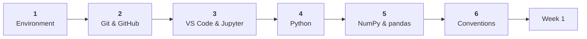

# Toolkit

Everything you install, configure, and refresh before Week 1. Budget three hours, do it in one sitting if you can, and you will not think about tooling again for the rest of the semester.

!!! warning "Do this in the first days"
    Week 1 assumes a working environment and a GitHub account you can push to. Setting up during the first lab means you spend that lab on installers instead of on your project.

---

## The path

Pages one to three are installation and configuration, in order. Pages four and five are refreshers you can skim or skip depending on how rusty you feel. Page six is the set of house rules every project follows, and it is the one to read carefully.

---

## Setup

-   :material-language-python:{ .lg .middle } **1. Environment setup**

    ---

    Python, virtual environments, and the libraries this course runs on. Ends with a script that verifies the whole thing.

    *45 minutes*

    [:octicons-arrow-right-24: Start here](environment-setup.md)

-   :material-git:{ .lg .middle } **2. Git & GitHub**

    ---

    Version control, authentication that actually works, and the daily commit loop. Every project is submitted as a repository.

    *60 minutes*

    [:octicons-arrow-right-24: Set up Git](git-and-github.md)

-   :material-microsoft-visual-studio-code:{ .lg .middle } **3. VS Code & Jupyter**

    ---

    Editor, extensions, notebooks, and the interpreter setting that causes most import errors when it is wrong.

    *45 minutes*

    [:octicons-arrow-right-24: Set up the editor](vscode-jupyter.md)

## Refreshers

-   :material-code-braces:{ .lg .middle } **4. Python refresher**

    ---

    The subset of Python this course leans on, plus the handful of traps that reliably cost people an afternoon.

    *30 minutes, skimmable*

    [:octicons-arrow-right-24: Refresh Python](python-refresher.md)

-   :material-table:{ .lg .middle } **5. NumPy & pandas refresher**

    ---

    Arrays, shapes, dataframes, grouping, joining, and the two warnings everyone hits. Where most of your time will go.

    *40 minutes*

    [:octicons-arrow-right-24: Refresh pandas](numpy-pandas.md)

## House rules

-   :material-folder-cog:{ .lg .middle } **6. Project repo conventions**

    ---

    The folder structure, naming, seeds, and README standard that every submitted project follows. Part of every rubric, so read this one properly.

    *20 minutes*

    [:octicons-arrow-right-24: Read the conventions](repo-conventions.md)

---

## Ready for Week 1?

- [ ] `python --version` shows 3.10 or higher
- [ ] A virtual environment activates and `check_setup.py` reports everything installed
- [ ] I can push a commit to a GitHub repository from my machine
- [ ] VS Code opens my project folder and uses the `.venv` interpreter
- [ ] A notebook runs a pandas cell without an import error
- [ ] I know why `data/raw/` never gets committed

All six ticked means you are done here.

!!! question "Something not working?"
    Each page has a **Common problems** section covering the errors that come up most. If you are still stuck after twenty minutes, ask in the course channel rather than alone. Your question is almost certainly someone else's too, and the [twenty-minute rule](../00-course/how-to-work.md) applies from day one.

---

**Next:** [Week 1, Problem framing and baselines](../02-data-pipeline/week-01-problem-framing.md)
