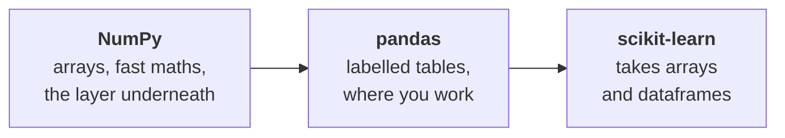

# NumPy & pandas Refresher

!!! abstract "At a glance"
    **Estimated time:** 40 minutes
    **You need:** the [Python refresher](python-refresher.md) behind you
    **This is:** the operations you will use every single week, and the two warnings that confuse everyone

## Why this page exists

Roughly eighty percent of your time in this course is spent moving data around before a model ever sees it. That work happens in pandas, sitting on top of NumPy. Being fluent here is the difference between spending a lab thinking about your problem and spending it fighting your tools.



---

# NumPy

## Arrays, not lists

An array holds one type and stores it contiguously, which is why operations on it run in compiled code rather than a Python loop.

```python
import numpy as np

a = np.array([1, 2, 3, 4])

a * 2            # [2 4 6 8], no loop needed
a + a            # elementwise
a.mean(), a.std(), a.sum()
```

This is vectorization. Write `a * 2`, never `[x * 2 for x in a]`. On a real dataset the difference is not stylistic, it is two orders of magnitude.

## Shape is everything

```python
X = np.zeros((100, 5))     # 100 rows, 5 features

X.shape       # (100, 5)
X.ndim        # 2
X.dtype       # float64

X.reshape(50, 10)
X.T                        # transpose, (5, 100)
```

!!! tip "The debugging habit"
    When an ML operation fails, print the shapes first. A large share of errors are a `(100,)` where a `(100, 1)` was expected, or two arrays that do not line up.

    ```python
    print(X.shape, y.shape)
    ```

## Indexing and masks

```python
X[0]              # first row
X[:, 2]           # third column, all rows
X[0:5, 1:3]       # slice both axes

mask = y > 0.5    # boolean array
X[mask]           # rows where the condition holds
```

Boolean masking is how you filter without loops, and pandas uses the same idea.

## Broadcasting

NumPy stretches smaller arrays to match larger ones when the shapes are compatible.

```python
X = np.ones((100, 3))
col_means = X.mean(axis=0)     # shape (3,)

centred = X - col_means        # works, applied to every row
```

`axis=0` means "down the rows", giving one value per column. `axis=1` means "across the columns", giving one value per row. Mixing these up is common, so check the shape of the result when unsure.

## Reproducibility

```python
rng = np.random.default_rng(seed=42)
sample = rng.normal(size=10)
```

Use a seeded generator, not the older `np.random.seed()`. Unseeded randomness makes your results unreproducible, which in this course means they are not results.

---

# pandas

```python
import pandas as pd
```

## Loading and first look

```python
df = pd.read_csv("data/raw/listings.csv")

df.shape
df.head()
df.info()            # dtypes and non-null counts, look here first
df.describe()        # numeric summary
df["city"].value_counts()
df.isna().sum()      # missing values per column
```

`df.info()` and `df.isna().sum()` are the two you run on every new dataset, every time.

## Selecting

```python
df["price"]                    # one column, a Series
df[["price", "area_m2"]]       # several columns, a DataFrame

df.loc[0, "price"]             # by label
df.iloc[0, 2]                  # by position

df.loc[df["price"] > 200, ["city", "price"]]
```

!!! note "`loc` versus `iloc`"
    `loc` uses labels and includes the end of a slice. `iloc` uses integer positions and excludes it, like normal Python. When the index is a default range they look identical, which is exactly why people get caught out later when it is not.

## Filtering

```python
df[df["price"] > 200]
df[(df["price"] > 200) & (df["city"] == "Tirana")]
df[df["city"].isin(["Tirana", "Durrës"])]
df.query("price > 200 and city == 'Tirana'")
```

Parentheses around each condition are required. Use `&` and `|`, not `and` and `or`.

## Creating and changing columns

```python
df["price_per_m2"] = df["price"] / df["area_m2"]

df["size_band"] = pd.cut(df["area_m2"], bins=[0, 50, 100, 1000],
                         labels=["small", "medium", "large"])

df["city"] = df["city"].str.strip().str.lower()

df = df.assign(age=2026 - df["year_built"])
```

## Missing values

```python
df.isna().sum()
df["area_m2"].fillna(df["area_m2"].median())
df.dropna(subset=["price"])
```

!!! warning "Do not fill missing values yet"
    Imputation is a modelling decision, and when you do it matters more than how. Filling before you split leaks information from your test set into training. Week 2 and Week 3 cover this properly. For now, look at missingness and describe it, but leave the handling until you have a pipeline.

## Grouping

```python
df.groupby("city")["price"].mean()

df.groupby("city").agg(
    median_price=("price", "median"),
    n=("price", "size"),
)

df.groupby(["city", "size_band"])["price"].median().unstack()
```

Grouped aggregation is how you answer most exploratory questions. Get comfortable with the `agg` form, since it names the output columns for you.

## Joining

```python
merged = df.merge(neighbourhoods, on="zip_code", how="left")
```

| `how` | Keeps |
|---|---|
| `left` | All rows from the left table |
| `inner` | Only rows matching in both |
| `outer` | Everything from both |

!!! danger "Check your row count after every merge"
    ```python
    print(len(df), len(merged))
    ```

    If the number grew, your join key is not unique and you have silently duplicated rows. This is quiet, common, and it will wreck your model. Check every time.

## Chaining

Long chains keep the sequence of operations visible and avoid intermediate variables you then forget to update.

```python
summary = (
    df
    .query("price > 0")
    .assign(price_per_m2=lambda d: d["price"] / d["area_m2"])
    .groupby("city")
    .agg(median_ppm2=("price_per_m2", "median"), n=("price", "size"))
    .sort_values("median_ppm2", ascending=False)
)
```

The `lambda d:` inside `assign` refers to the dataframe as it is at that point in the chain, which is what lets you use a column you just created.

## The warning everyone hits

!!! failure "`SettingWithCopyWarning`"
    ```python
    subset = df[df["price"] > 200]
    subset["flag"] = True          # warning
    ```

    pandas cannot tell whether `subset` is a view into `df` or a copy, so your assignment may or may not affect the original. Be explicit:

    ```python
    subset = df[df["price"] > 200].copy()
    subset["flag"] = True          # fine
    ```

    Rule of thumb: if you filter and then modify, add `.copy()`.

## Going to scikit-learn

```python
X = df.drop(columns=["price"])
y = df["price"]
```

Modern scikit-learn accepts dataframes directly and keeps your column names, which makes feature importance readable later. Prefer passing the dataframe over converting to `.values`.

## Quick self-check

- [ ] What is the difference between `df.loc[0]` and `df.iloc[0]`?
- [ ] Why does `df[df.a > 1 and df.b < 2]` fail?
- [ ] What does `axis=0` mean in `X.mean(axis=0)`?
- [ ] What should you check immediately after a merge?
- [ ] When does `SettingWithCopyWarning` appear, and what fixes it?

## Quick reference

| Task | Code |
|---|---|
| Load CSV | `pd.read_csv(path)` |
| Structure and dtypes | `df.info()` |
| Missing per column | `df.isna().sum()` |
| Category counts | `df["col"].value_counts()` |
| Filter | `df[df["col"] > x]` |
| Select by label | `df.loc[rows, cols]` |
| Select by position | `df.iloc[rows, cols]` |
| New column | `df["new"] = ...` |
| Group and aggregate | `df.groupby("k").agg(...)` |
| Join | `df.merge(other, on="k", how="left")` |
| Sort | `df.sort_values("col", ascending=False)` |
| Drop duplicates | `df.drop_duplicates()` |

## Summary and next steps

You can load a dataset, understand its shape and gaps, filter and derive columns, aggregate, and join, without writing a single loop. That is the toolkit for the first four weeks.

**Next:** [Project repo conventions](repo-conventions.md), the last setup page, which sets the house rules every project follows.

## Resources

- [pandas user guide](https://pandas.pydata.org/docs/user_guide/index.html), the official reference, better than most tutorials
- [NumPy absolute basics](https://numpy.org/doc/stable/user/absolute_beginners.html) for a clear introduction to arrays
- [Effective pandas](https://leanpub.com/effective-pandas) by Matt Harrison for the chaining style used above
- [10 minutes to pandas](https://pandas.pydata.org/docs/user_guide/10min.html) as a fast tour if you want one more pass
