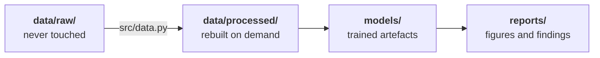

# Project Repo Conventions

!!! abstract "At a glance"
    **Estimated time:** 20 minutes
    **Applies to:** every project you submit in this course
    **The test it all serves:** someone else clones your repo, follows your README, and it runs

## Why this page exists

These are the house rules. They are not style preferences, they are what makes a project reviewable, and part of every rubric.

The standard is simple and it is the same every time. A classmate who has never seen your work should be able to clone the repository, read the README, run one or two commands, and reproduce your results. If that fails, the project is incomplete regardless of how good the model is.

---

## The structure

Every project starts from this shape.

```text
ml-project-1/
├── .venv/                  # environment, never committed
├── data/
│   ├── raw/                # original files, read-only, never committed
│   └── processed/          # generated by code, never committed
├── notebooks/
│   ├── 01-explore.ipynb
│   ├── 02-features.ipynb
│   └── 03-baseline.ipynb
├── src/
│   ├── __init__.py
│   ├── data.py             # loading and cleaning
│   ├── features.py         # feature engineering
│   ├── models.py           # training and prediction
│   └── evaluate.py         # metrics and plots
├── models/                 # saved artefacts, never committed
├── reports/
│   ├── figures/
│   └── report.md
├── .gitignore
├── requirements.txt
└── README.md
```

Create it in one line:

```bash
mkdir -p data/raw data/processed notebooks src models reports/figures
touch src/__init__.py README.md requirements.txt
```

!!! note "Not every project needs every folder"
    A small project may have two notebooks and one module. Keep the names and the meanings, drop what you do not use. Do not invent a new layout each time, because the point of a convention is that a reviewer knows where to look without being told.

## Where things go

| If it is | It lives in | Why |
|---|---|---|
| An original data file | `data/raw/` | Never edited, never committed |
| A cleaned or derived table | `data/processed/` | Generated by code, so it is disposable |
| Exploration, plots, narrative | `notebooks/` | Thinking, in order |
| A function used more than once | `src/` | Shared code has one home |
| A trained model or encoder | `models/` | Output, not source |
| A figure for your report | `reports/figures/` | Findable when writing |

The rule that decides most cases: **if code generates it, it does not belong in Git. If a person wrote it, it does.**

## Raw data is read-only



Everything downstream of `raw/` must be reproducible by running your code. The test is blunt: delete `data/processed/` and `models/`, run your pipeline, and get the same results back.

The moment you hand-edit a CSV, you create a step that exists only in your memory. Two weeks later you will not remember it, and nobody else could repeat it.

## Never commit

!!! danger "Four things that stay out of Git"
    **Data.** Large, often licensed, sometimes personal. Document the source in your README and let code fetch or load it.

    **The environment.** `.venv/` is hundreds of megabytes and specific to your machine. `requirements.txt` replaces it.

    **Models.** Binary, large, and regenerable by running your training script.

    **Secrets.** API keys and tokens. Once pushed, treat them as compromised even after deletion, because they remain in history.

Your `.gitignore` from the [Git page](git-and-github.md) already handles all four. Check it is in place before your first commit, not after.

## Naming

Boring and consistent beats clever.

| Thing | Convention | Example |
|---|---|---|
| Repository | lowercase, hyphens | `ml-project-1-housing` |
| Notebooks | numbered prefix | `02-feature-engineering.ipynb` |
| Python files | lowercase, underscores | `feature_engineering.py` |
| Functions | verbs, snake case | `load_listings()`, `encode_categoricals()` |
| Constants | upper case | `RANDOM_STATE = 42` |
| Fitted attributes | trailing underscore | `self.median_` |

Numbered notebooks matter more than they look. They tell a reviewer the reading order without a single word of explanation.

## Reproducibility rules

!!! success "Non-negotiable in every submission"

    **Seed everything.** One constant, used everywhere.

    ```python
    RANDOM_STATE = 42

    train_test_split(X, y, random_state=RANDOM_STATE)
    RandomForestClassifier(random_state=RANDOM_STATE)
    ```

    **No absolute paths.** Use `pathlib` relative to the project root.

    ```python
    from pathlib import Path
    DATA = Path(__file__).resolve().parents[1] / "data"
    ```

    **`requirements.txt` stays current.** Every new library goes in it the day you install it.

    **Notebooks run top to bottom.** Restart and run all before every push. See the [VS Code page](vscode-jupyter.md) for the `nbstripout` setup that keeps outputs out of Git.

    **Configuration in one place.** Paths, seeds, and hyperparameters at the top of a module or in a small `config.py`. Not scattered through fifteen cells.

## The README

This is the first thing a reviewer reads and often the only thing that decides whether they can run your work. Write it as you go, not the night before.

```markdown
# Project title

One or two sentences: what problem, what data, what result.

## Problem

What is being predicted, for whom, and how success is measured.

## Data

Source, licence, size, and how to obtain it. If it downloads automatically,
say so. If not, give the exact steps.

## Setup

```bash
python -m venv .venv
source .venv/bin/activate
python -m pip install -r requirements.txt
```

## Running it

```bash
python -m src.train
```

What this produces and roughly how long it takes.

## Results

The headline number, the metric, and the validation setup that produced it.
A table or a figure.

## What did not work

Approaches tried and abandoned, with a line on why. This section is graded.

## Limitations

Where the model fails and who should not rely on it.

## AI assistance

Where you used AI tools and for what.
```

!!! tip "Fill the sections as you reach them"
    Write Problem and Data in week one. Add Results when you have them. The README is then finished when the project is, rather than being a rushed job at the end that reads like one.

## Before you submit

Run through this every time.

- [ ] `README.md` complete, with setup and run instructions that work
- [ ] `requirements.txt` current and complete
- [ ] `.gitignore` excluding `.venv/`, `data/`, `models/`
- [ ] No data files, no secrets, no `.venv` anywhere in the history
- [ ] Notebooks restart-and-run-all clean, outputs stripped
- [ ] Seeds set on every split and every model
- [ ] No absolute paths
- [ ] Reused code lives in `src/`, not copied between notebooks
- [ ] More than one commit, with messages that mean something
- [ ] Repository is public, or I have been added as a collaborator

Then do the real test:

```bash
cd /tmp
git clone https://github.com/YOUR-USERNAME/your-project.git fresh
cd fresh
# follow your own README, exactly, without improvising
```

Nearly everyone finds a missing step the first time. That is the point of doing it yourself first.

## Summary and next steps

One structure, reused across all three projects, so the shape of the work stops being a decision and the review is about the thinking rather than the filing.

**Three rules that cover most of this page:**

- **If code generates it, Git does not store it.**
- **Raw data is read-only, and everything downstream rebuilds from it.**
- **The README is the deliverable that makes the rest of the deliverable usable.**

**Next:** you are set up. Go to [Week 1](../02-data-pipeline/week-01-problem-framing.md).

## Resources

- [Cookiecutter Data Science](https://cookiecutter-data-science.drivendata.org/) for the widely used version of this structure
- [The Turing Way, reproducible research](https://book.the-turing-way.org/reproducible-research/reproducible-research) for the reasoning behind these rules
- [Submission guide](../05-projects/submission-guide.md) for what each specific project expects on top of these conventions
