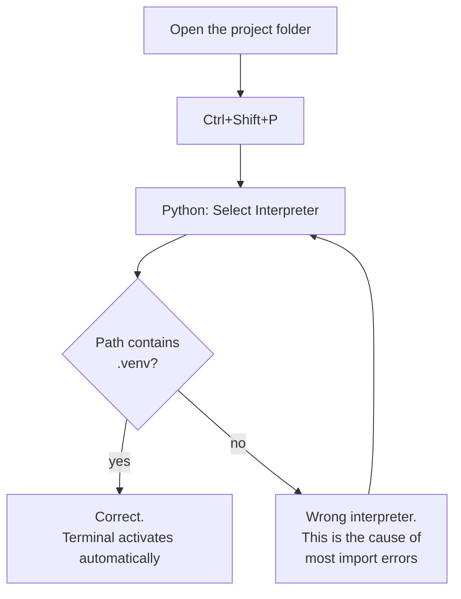
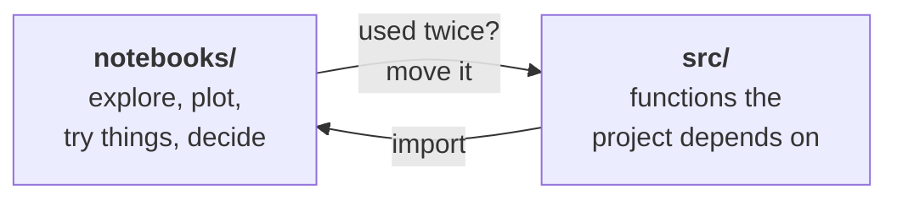

# VS Code & Jupyter

!!! abstract "At a glance"
    **Estimated time:** 45 minutes
    **You need:** a finished [environment setup](environment-setup.md) and [Git setup](git-and-github.md)
    **You end with:** a working editor, notebooks running inside it, and a clear sense of when to use which
    **Do this before:** Week 1

## Why this matters

> Notebooks are where you think. Scripts are where you ship. Confusing the two is the most common way student projects fall apart.

A Jupyter notebook is an excellent place to look at data. You load a dataframe, plot it, change one thing, plot it again. That loop is fast and it is exactly what the first weeks of this course ask you to do.

The same notebook is a poor place to keep code that other parts of your project depend on. Cells can run in any order, so a notebook that works on your screen may not work when run from top to bottom. State persists invisibly, so a variable you defined and then deleted from a cell is still alive in memory and your code still runs, right up until someone else opens it. And the file format makes Git diffs close to unreadable.

Good projects use both, with a clear line between them. This page sets up the tooling and shows you where that line goes.

## Step 1: Install VS Code

Download it from [code.visualstudio.com](https://code.visualstudio.com/) and install with the defaults.

!!! tip "WSL users"
    Install VS Code on Windows, not inside WSL. It detects WSL and connects across the boundary. From a WSL terminal, `code .` opens the current folder with everything running on the Linux side.

## Step 2: Install the extensions you need

Open the Extensions panel with ++ctrl+shift+x++ (++cmd+shift+x++ on macOS) and install these four.

| Extension | Publisher | What it gives you |
|---|---|---|
| **Python** | Microsoft | Interpreter selection, debugging, IntelliSense |
| **Jupyter** | Microsoft | Notebooks running natively inside VS Code |
| **Ruff** | Astral | Fast linting and formatting |
| **WSL** | Microsoft | Only if you are on Windows with WSL |

??? tip "Worth having, not required"
    - **GitLens** for seeing who changed a line and when
    - **Data Wrangler** from Microsoft, a point and click view of dataframes that writes the pandas code for you
    - **Rainbow CSV** for making raw CSV files readable
    - **Error Lens** for showing errors inline instead of only in the problems panel

## Step 3: The step everyone gets wrong

VS Code has to be told which Python to use. If you skip this, you will install a package in the terminal, import it in a notebook, and get `ModuleNotFoundError` while staring at the successful install two lines above.

**Always open the project folder, not a single file.**

```bash
cd ~/projects/ml-project-1
code .
```

Then select the interpreter:

1. Press ++ctrl+shift+p++ (++cmd+shift+p++ on macOS)
2. Type `Python: Select Interpreter`
3. Choose the one whose path contains `.venv`



The selected interpreter appears in the status bar at the bottom right. Glance at it whenever an import fails unexpectedly.

Once it is set, every terminal you open inside VS Code activates the environment automatically, and you stop having to think about it.

## Step 4: Run a notebook

Create `notebooks/01-explore.ipynb`, or from the command palette run `Jupyter: Create New Blank Notebook`.

In the top right of the notebook, click the kernel selector and pick the same `.venv` interpreter. The kernel is chosen separately from the editor interpreter, which is a second place the same mistake can happen.

Try it:

```python
import pandas as pd
import numpy as np
import matplotlib.pyplot as plt

df = pd.DataFrame({
    "x": np.random.normal(size=200),
    "group": np.random.choice(["a", "b"], size=200),
})

df.groupby("group")["x"].describe()
```

Run a cell with ++shift+enter++.

### Shortcuts worth learning now

Notebooks have two modes. **Command mode** (press ++escape++) acts on cells. **Edit mode** (press ++enter++) types inside one. The blue and green border tells you which you are in.

| Keys | Does |
|---|---|
| ++shift+enter++ | Run cell, move to next |
| ++ctrl+enter++ | Run cell, stay |
| ++a++ / ++b++ | Insert cell above / below (command mode) |
| ++d++ ++d++ | Delete cell (command mode) |
| ++m++ / ++y++ | Switch to markdown / code (command mode) |
| ++z++ | Undo cell operation |
| ++shift+l++ | Toggle line numbers |

## Step 5: Notebook hygiene

This section is short and it matters more than anything else on this page.

!!! danger "Restart and run all, before you commit"
    The only proof that a notebook works is that it runs top to bottom in a fresh kernel. Use **Restart Kernel and Run All Cells** from the toolbar. If it fails, it was broken and you could not see it.

    Do this before every push. It takes thirty seconds and it is the difference between a reviewer running your work and a reviewer emailing you.

**Clear outputs before committing.** Outputs are stored inside the `.ipynb` file as JSON, including base64 images. They make diffs enormous and merge conflicts unresolvable. Set this up once and forget about it:

```bash
python -m pip install nbstripout
nbstripout --install
```

That installs a Git filter in your repository which strips outputs automatically when you commit. The notebook on your screen keeps its outputs, the version in Git does not.

**Number your notebooks.** `01-explore.ipynb`, `02-features.ipynb`, `03-baseline.ipynb`. Reading order becomes obvious, to reviewers and to you in a month.

**Write markdown between the cells.** Not a paragraph, one line. What are you doing in this section, and what did you conclude. When you write your report, these lines are the outline.

## Step 6: Where notebooks end and code begins

Here is the line, and it is simple.



**If a piece of code is used twice, it belongs in `src/`.** That is the whole rule.

Say you wrote a cleaning function in your exploration notebook and now you need it in your modelling notebook. Copying it creates two versions that will drift apart, and you will fix a bug in one and not the other. Instead, move it:

```python title="src/preprocessing.py"
import pandas as pd


def clean_listings(df: pd.DataFrame) -> pd.DataFrame:
    """Drop duplicates and impossible values from the raw listings table."""
    df = df.drop_duplicates()
    df = df[df["area_m2"] > 0]
    return df
```

And import it in any notebook:

```python
import sys
sys.path.append("..")

from src.preprocessing import clean_listings

df = clean_listings(raw_df)
```

Add this at the top of notebooks so edits to `src/` take effect without restarting the kernel:

```python
%load_ext autoreload
%autoreload 2
```

!!! note "Why this matters for your grade"
    A project where all the logic lives in `src/` and notebooks only orchestrate is testable, reusable, and reviewable. A project where everything lives in one 900-cell notebook is none of those things. The rubrics reward the first shape.

## Step 7: Debugging

When something goes wrong, `print()` gets you surprisingly far. When it does not, VS Code has a real debugger and it works in notebooks too.

Click to the left of a line number to set a breakpoint, then run the cell with **Debug Cell**. Execution stops there and you can inspect every variable in the sidebar.

For scripts, press ++f5++. VS Code will ask for a configuration, choose **Python File**.

| Key | Action |
|---|---|
| ++f5++ | Start or continue |
| ++f10++ | Step over |
| ++f11++ | Step into |
| ++shift+f5++ | Stop |

!!! tip "The fastest debugging habit in data work"
    Before reaching for the debugger, print the shape and the dtypes.

    ```python
    print(df.shape)
    print(df.dtypes)
    print(df.isna().sum())
    ```

    A large share of machine learning bugs are shape mismatches, unexpected object columns, or NaNs arriving where you did not expect them. Three lines finds them.

## Common problems

!!! failure "Things that go wrong, and why"

    **`ModuleNotFoundError` in a notebook, but the package is installed.** The kernel is pointing at a different Python. Click the kernel name in the top right and pick the `.venv` one.

    **The terminal does not activate the environment.** You opened a file rather than a folder. Close it, then `code .` from the project directory.

    **Plots do not appear.** In notebooks you rarely need anything, but if a figure is missing, add `%matplotlib inline` at the top.

    **Git shows a notebook as changed when you only opened it.** Execution counts and metadata changed. `nbstripout` from Step 5 removes this problem entirely.

    **Imports from `src/` fail.** Either add `sys.path.append("..")` at the top of the notebook, or open VS Code from the project root so relative paths resolve.

    **VS Code is slow on WSL.** The project is probably on `/mnt/c/`. Move it to `~/projects/` inside the Linux filesystem.

## Quick reference

| Task | How |
|---|---|
| Open project | `code .` from the project folder |
| Command palette | ++ctrl+shift+p++ |
| Select interpreter | Palette, then `Python: Select Interpreter` |
| New notebook | Palette, then `Jupyter: Create New Blank Notebook` |
| Run cell | ++shift+enter++ |
| Restart and run all | Notebook toolbar |
| Integrated terminal | ++ctrl+grave++ |
| Find in all files | ++ctrl+shift+f++ |
| Format file | ++shift+alt+f++ |
| Go to definition | ++f12++ |

## Summary and next steps

Your editor now knows which Python you are using, notebooks run inside it, and you have a rule for when code graduates out of a notebook and into a module.

**Three habits worth keeping:**

- **Restart and run all before every push.** It is the only honest test that a notebook works.
- **Twice used means it moves to `src/`.** Duplicated code diverges, always.
- **Check the interpreter in the status bar when imports misbehave.** It explains the problem most of the time.

**Next:** the [Python refresher](python-refresher.md) and [NumPy and pandas refresher](numpy-pandas.md) if either feels rusty. Otherwise you are ready for Week 1.

## Resources

- [VS Code Python tutorial](https://code.visualstudio.com/docs/python/python-tutorial) from Microsoft
- [Jupyter notebooks in VS Code](https://code.visualstudio.com/docs/datascience/jupyter-notebooks) covering the notebook features in full
- [nbstripout](https://github.com/kynan/nbstripout) for the output stripping setup
- [Joel Grus, "I Don't Like Notebooks"](https://www.youtube.com/watch?v=7jiPeIFXb6U), a sharp and funny talk on notebook failure modes, worth watching even though this course uses them

!!! quote
    A notebook that only runs in the order you happened to click the cells is not a result. It is a coincidence.
