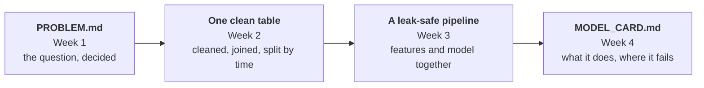

# Block 1 · In review

Four weeks, one question, and a number we learned to trust.

Block 1 asked a single question, *will this order arrive late?*, and spent four weeks learning how to answer it honestly. Almost none of that time went on the model. It went on everything that decides whether a model's score means anything: what exactly is being predicted, what the model is allowed to know, what it is tested on, and what the score hides.

This page pulls the four weeks together, and hands over to Project 1 and Block 2.

## The journey of one number { .section-label }

Lift, how many times better than guessing, was the block's running score. Follow it across the four weeks and the whole argument is there.

In **Week 1**, simple baselines scored one and a half times better than guessing. It looked like a start. In **Week 2**, the honest split, training on the past and testing on the future, showed they were barely better than guessing at all: the random split had let them learn from the months they were judged on. In **Week 3**, features built from what exists at the moment of purchase lifted the honest score to 1.87. In **Week 4**, that number gained an interval, 1.73 to 2.06, clear of the baseline on every resample.

And then the lesson a single number cannot hold. At a threshold chosen carefully on validation, the same model saved 43% of the cost of mistakes in one period, and cost more than doing nothing in the calmer months that followed. The ranking held. The decision did not.

**A score you can trust is not the same as a decision you can trust.**

Block 1 taught both. The first depends on how you build and test. The second depends on the world, and the world moves.

## Four lies, caught { .section-label }

The block opened with four ways a score can lie. Each week caught one, and Olist gave every one of them a real, specific face.

-   :material-ruler:{ .lg .middle } **Week 01 · "It beats nothing"**

    ---

    **Caught by:** a precise target and a baseline ladder.

    **In Olist:** comparing a date with a timestamp silently mislabelled 1,291 punctual deliveries, and doing nothing at all scored 93% accuracy.

    [:octicons-arrow-right-24: Week 01](week-01-problem-framing.md)

-   :material-call-split:{ .lg .middle } **Week 02 · "The test set was unseen"**

    ---

    **Caught by:** knowing the grain, and splitting by time.

    **In Olist:** a join turned 96,204 orders into 114,521 rows without a word, and a random split made weak baselines look 1.5 times better than guessing.

    [:octicons-arrow-right-24: Week 02](week-02-data-quality.md)

-   :material-pipe-leak:{ .lg .middle } **Week 03 · "The features are fair"**

    ---

    **Caught by:** learning only from training rows, inside a pipeline.

    **In Olist:** a seller's late rate scored 1.89 when computed on all orders, and 1.21 when computed honestly. The simple features won.

    [:octicons-arrow-right-24: Week 03](week-03-feature-engineering.md)

-   :material-magnify:{ .lg .middle } **Week 04 · "The average is fine"**

    ---

    **Caught by:** slices, an interval, and evaluating the decision.

    **In Olist:** 68% of late orders caught overall, 15% within one state, and a threshold that stopped paying when late orders became rare.

    [:octicons-arrow-right-24: Week 04](week-04-evaluation.md)

## What you built { .section-label }

Four weeks, four pieces, each one the input to the next.

The problem card records what was decided before anything was built. The cleaning function rebuilds the data from the raw files, and never learns from it. The pipeline holds every learned step and the model, so nothing can be fitted on the wrong rows. The model card records what was built and what was found, including the results nobody enjoys reporting. Together they are what someone else needs to trust, rerun, or challenge your work, and that is the point.

## Six rules to carry forward { .section-label }

Everything in Block 1, compressed. Each one holds on any dataset.

  
<b>The target is a decision.</b> Write down every choice it hides, and what each did to the positive rate.

  
<b>Split before you look, and split the way the model will be used.</b> Future data: by time. New people: by group.

  
<b>If a value could change with the split, it is learned.</b> Fit it on training rows only, inside a pipeline.

  
<b>A feature earns its place on validation.</b> Test is looked at once, at the end.

  
<b>Report the interval, not just the score, and the slices, not just the average.</b>

  
<b>Evaluate the decision, not just the ranking.</b> And plan for the world to move after you ship.

## Can you…? { .section-label }

Before Project 1, check yourself honestly. Each line links back to where it was taught.

- [ ] Turn a vague request into a one-sentence question with a moment of prediction · [Week 01](week-01-problem-framing.md)
- [ ] List the decisions inside a target, and say what each did to the positive rate · [Week 01](week-01-problem-framing.md)
- [ ] Test the grain of a table, and join without adding or losing rows · [Week 02](week-02-data-quality.md)
- [ ] Audit a dataset with the six-point checklist, and decide to fix, flag, or drop · [Week 02](week-02-data-quality.md)
- [ ] Choose a split from who, or when, the model will be used on · [Week 02](week-02-data-quality.md)
- [ ] Build row-wise and learned features without leaking, inside one pipeline · [Week 03](week-03-feature-engineering.md)
- [ ] Choose a threshold from the cost of mistakes, and break the errors down by slice · [Week 04](week-04-evaluation.md)
- [ ] Report a test score with an interval, and write a model card · [Week 04](week-04-evaluation.md)

If any line makes you hesitate, go back to that week's *Check yourself* questions before starting the project.

## What Block 1 left open { .section-label }

A good block ends with better questions than it started with. These are the ones Block 1 raised, and where they are answered.

| The question | Where it is answered |
|---|---|
| What is logistic regression actually doing when it fits? What do its weights mean? | [Week 05](../03-models-optimization/week-05-linear-models.md) and [Week 06](../03-models-optimization/week-06-optimization.md) |
| Why did the tree lose to logistic regression here, and when do trees win? | [Week 07](../03-models-optimization/week-07-regularization.md) and [Week 08](../03-models-optimization/week-08-tree-models.md) |
| Can the scores become honest probabilities? How do you compare many models fairly? | [Week 09](../03-models-optimization/week-09-model-selection.md) |
| How do you notice when the world changes under a model that is already in use? | [Week 13](../04-representation-systems/week-13-ml-systems.md) |

Block 2 keeps Olist as its running example, so the questions come with their data.

## Into Project 1 { .section-label }

**Now do all of it again, without the notebook.**

Everything in class happened on Olist, with the steps laid out. Project 1 gives your team a dataset you have not seen, and asks for the same four stages, with every decision yours to make and defend.

What the project asks for, stage by stage:

| Stage | In your repository |
|---|---|
| Frame | `PROBLEM.md`, written before any modelling |
| Split | A cleaning function that rebuilds the data from the raw files, and a split with its reasoning |
| Build | A pipeline that cannot leak, and a baseline ladder to beat |
| Evaluate | Results by slice, a test score with an interval, and `MODEL_CARD.md` |

Full details are in the [Project 1 brief](../05-projects/project-1-pipeline.md), and the [rubrics](../05-projects/rubrics.md) show exactly how each part is graded.

---

**Next:** [Block 2 · Models & Optimization](../03-models-optimization/index.md)

!!! quote
    Start simple, measure honestly, and only then trust the number.
