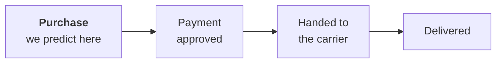

# Week 01 · Problem framing & baselines

!!! abstract "At a glance"
    **Block:** 1 · Data & the Pipeline
    **Lab:** [`week-01/lab.ipynb`](https://github.com/evisp/ml-course-labs/blob/main/week-01/lab.ipynb) in the labs repository
    **Data today:** two Olist tables, orders and customers
    **Feeds into:** Project 1, which starts with a problem card
    **Before class:** read sections 1, 2 and 4, about fifteen minutes

## Why this matters

> Most failed machine learning projects answer the wrong question very well.

The expensive mistakes in this field are rarely about algorithms. They happen in the first hour, when someone agrees to "use AI to improve satisfaction" without deciding what exactly will be predicted, for whom, and at what moment. Everything built after that inherits the vagueness.

This week you do that first hour properly. You turn a vague request into a precise question, discover that even the definition of the answer is a decision, and measure how well you can do by barely trying. Only then does a real model have something to beat.

## Learning outcomes

By the end of this week you can:

- [ ] Turn a vague request into a question with a target, a unit, and a moment of prediction
- [ ] Define a target precisely, and show how the definition changes the data
- [ ] Say which information exists at prediction time, and which does not yet
- [ ] Build a baseline ladder, and explain why accuracy misleads when one class is rare
- [ ] Recognise a leak by its symptom: a score that is too good
- [ ] Write a problem card for any project

## Before class

Read sections 1, 2 and 4. Then come with an answer to this:

!!! question "Bring an answer"
    Think of an app you use every day. What is one thing it predicts about you, and at what exact moment does it make that prediction?

---

## 1. From a request to a question

Real projects rarely start with a question. They start with a wish. Suppose the head of customer experience at Olist sends this:

> *"We want to use AI to improve customer satisfaction."*

Nothing in that sentence can be predicted. It needs narrowing, and the narrowing happens one question at a time.

| Ask | Answer for Olist |
|---|---|
| What goes wrong for unhappy customers? | Very often, the parcel arrives late |
| What would anyone do differently if they knew in advance? | Warn the customer, or prioritise the shipment |
| When would they need to know? | As early as possible, ideally when the order is placed |
| What exactly would be predicted? | Whether this order will arrive after the promised date |

Which lands on the question for this whole block:

<div class="principle" markdown>

**At the moment a customer places an order, will it arrive after the date we promised?**

A yes or no answer, about one order, made at one precise moment, supporting one decision.

</div>

Notice that the final question is narrower than the wish. That is the point. A narrow question can be answered, measured, and improved. A wish cannot.

## 2. Should this even be machine learning?

Before building anything, check that machine learning is the right tool. Four questions:

| Question | Late delivery |
|---|---|
| Is there a pattern to learn? | Probably. Some states and some promises go wrong more than others |
| Is there data showing that pattern? | Yes, around 96,000 labelled orders |
| Can the task tolerate some mistakes? | Yes. A wrong warning costs one unnecessary message |
| Does the pattern change over time? | Yes, a lot, as you will see. That is a reason for care, not a reason to stop |

And one more question that is easy to skip: **would a simple rule do almost as well?** If a two-line rule gets you most of the way, use the rule. It is cheaper, easier to explain, and easier to fix. Section 7 puts this to the test.

## 3. Where this sits on the map

| Family | Learns from | Examples |
|---|---|---|
| **Supervised** | Examples with the right answer attached | Predicting a price (regression), predicting late or on time (classification) |
| **Unsupervised** | Examples without answers | Grouping customers, compressing features. Block 3. |
| **Reinforcement** | Rewards from acting in an environment | Game playing, robotics. Named here for the map, not covered in this course. |

Late delivery is **supervised binary classification**, and, as you are about to see, heavily **imbalanced**: one class is far rarer than the other.

## 4. The target is a decision

"Late" sounds obvious. Pin it down and three decisions appear, each one changing the data.

**Which orders can be labelled?** An order that never arrived has no delivery date, so there is nothing to compare. We leave out the 2,965 orders that were cancelled, never shipped, or still travelling when the data was collected. Write that down: the model will only ever know about orders that were delivered.

**Which months can be trusted?** The first months of 2016 hold a handful of orders, and the last months of 2018 almost none. We keep **January 2017 to August 2018**, twenty full months.

| Step | Orders |
|---|--:|
| Everything in the table | 99,441 |
| Delivered, so they can be labelled | 96,476 |
| Inside January 2017 to August 2018 | **96,204** |

**What exactly counts as late?** Here is the trap. The promised date has no time attached: every single one is stored at midnight. The delivery has a full timestamp. So a parcel promised for Tuesday and delivered on Tuesday at two in the afternoon is, by the obvious rule, *later than midnight*, and therefore late.

```python
late_by_timestamp = arrived > promised                  # 8.1% late
late_by_day = arrived.dt.normalize() > promised         # 6.8% late
```

`normalize()` drops the time and keeps the date. The two definitions disagree on **1,291 orders**, every one of them delivered on the promised day. No customer would call those late, so we use the calendar-day definition.

!!! note "Key insight"
    **The target is something you decide, not something you find.** A single character in one line of code moved the late rate from 8.1% to 6.8%, and the wrong choice would have taught the model that 1,291 punctual deliveries were failures. Every target in every project deserves this much suspicion.

About one order in fifteen arrives late. Remember that number: a model that always says *on time* is right 93% of the time without learning anything.

## 5. Look before you model

Two charts, drawn before any model exists, change how we think about the problem.


*The share of orders delivered late, by the month they were placed.*

For most of 2017 the late rate stays between about 3% and 5%. Then it jumps to 12% in November 2017, the month of Black Friday, climbs to 19% in March 2018, and falls to around 1% in June. A model trained on one of these periods and used in another is working on a different problem from the one it learned. Keep this chart in mind: it opens Week 2.


*Late rate by the customer's state. Northern states are highlighted.*

Most people guess that the far north, thousands of kilometres from the big sellers in São Paulo, would be the worst. The chart disagrees. The four states deep in the Amazon, Amazonas, Amapá, Rondônia and Acre, are the **most reliable in the country**. The worst are in the northeast, led by Alagoas at 21.5%, and Rio de Janeiro, right next to São Paulo, is late about one time in eight.

A likely reason: remote customers are promised long delivery windows, so even a slow parcel arrives "on time". Lateness is measured against the promise, not against the distance.

!!! tip "Check your intuition before you build on it"
    A rule based on the first guess would have flagged exactly the wrong states. And look twice at small groups: Roraima has only 40 orders, so two or three late parcels swing its rate a long way.

## 6. What is known at the moment of prediction

We promised to predict at the moment of purchase. So a feature is only allowed if it exists at that moment.



Everything to the right of the first box is still in the future.

| Column | Known at purchase? |
|---|---|
| `order_purchase_timestamp` | Yes |
| `order_estimated_delivery_date` | Yes, the customer sees it at checkout |
| `customer_state` | Yes |
| `order_approved_at` | No, it comes minutes or hours later |
| `order_delivered_carrier_date` | No |
| `order_delivered_customer_date` | No, and it is the answer itself |

From the allowed columns we build four simple features: **`window_days`**, how long we promised, typically 24 days; **`weekday`** and **`hour`**, when the order was placed; and **`customer_state`**, where it is going.

## 7. The baseline ladder

Before any serious model, climb three rungs. Each one is the bar the next must clear.

| Rung | Idea | In our case |
|---|---|---|
| 1 · No skill | Always give the most common answer | Always predict *on time* |
| 2 · A rule | Something a person could write on a sticky note | Flag orders to states that are often late |
| 3 · A tiny model | The simplest model that can learn anything | A decision tree two levels deep |

We score them on a held-out 20% of the orders.

!!! warning "A random split, for now"
    The test orders are picked at random from all twenty months. After the monthly chart in section 5, that should make you uneasy. Week 2 retests everything on a split that respects time, and the numbers below get worse.


| | Accuracy | Precision | Recall | PR AUC |
|---|:--:|:--:|:--:|:--:|
| Always on time | **0.932** | 0 | 0 | 0.068 |
| Rule: high-risk states | 0.758 | 0.118 | 0.394 | 0.102 |
| Depth-2 tree | 0.753 | 0.131 | 0.470 | 0.102 |

Three things to take from this.

**Accuracy lies.** Doing nothing scores 93%, higher than both rungs that actually try, because it is right about the easy majority and ignores every late order. When one class is rare, report recall and PR AUC instead. Random guessing scores a PR AUC equal to the late rate, 0.068, and that is the real floor. The [metrics page](../06-reference/metrics.md) explains why.

**The honest result is modest.** The rule catches about four in ten late orders. The tree catches almost half, with slightly better precision. Both lift PR AUC from 0.068 to 0.102. With two tables and only what is known at purchase, there is not much signal, and that is useful to know. The rest of it lives in the other seven tables: sellers, products, weights, freight.

**The tree is readable**, and it found the same two ideas the charts showed:

```text
state_rate <= 0.07
    window_days <= 9.5    → late
    window_days  > 9.5    → on time
state_rate  > 0.07
    window_days <= 32.5   → late
    window_days  > 32.5   → on time
```

In a reliable state, only very short promises are risky. In an unreliable one, almost any promise under a month is.

## 8. What a leak looks like

Now imagine a teammate adds one more feature: how many days the delivery actually took.

| | Accuracy | Precision | Recall | PR AUC |
|---|:--:|:--:|:--:|:--:|
| Depth-2 tree | 0.753 | 0.131 | 0.470 | 0.102 |
| **With actual delivery days** | **0.985** | **0.963** | **0.807** | **0.896** |

By far the best model, and completely useless. The delivery time only exists once the parcel has arrived. At the moment of purchase it has not happened yet. The model has not learned to predict lateness. It has learned to read the answer.

!!! danger "Nothing crashed"
    No error, no warning. The score simply got better, which is exactly what makes leaks dangerous. Whenever a score jumps, ask first: **could any feature only be known after the moment of prediction?** This leak was easy to spot. Week 3 hunts for much quieter ones.

## 9. The problem card

Everything decided this week, in one place:

| | |
|---|---|
| **Question** | Will this order arrive after the promised date? |
| **Target** | `is_late` is 1 when delivered on a later calendar day than promised |
| **One row is** | One order |
| **Predict at** | The moment the customer places the order |
| **Allowed information** | Purchase time, promised delivery date, customer's state |
| **Left out** | Orders never delivered; orders outside January 2017 to August 2018 |
| **Positive rate** | 6.8% |
| **Decision it supports** | Warn the customer early, or prioritise the shipment |
| **Costly mistake** | Missing a late order. A false alarm only costs one unnecessary message. |
| **Metric** | Recall and PR AUC. Never accuracy alone. |
| **Baseline to beat** | PR AUC 0.102, from the high-risk states rule |

Every project in this course starts with one. It lives in a file called `PROBLEM.md` at the root of your repository, written **before** any modelling. If a decision changes later, update the card and note what changed and why. A card that silently drifts away from the project is worse than none.

Copy the template with the button in the top right of the block:

```markdown
# Problem card

| | |
|---|---|
| **Question** | |
| **Target** | |
| **One row is** | |
| **Predict at** | |
| **Allowed information** | |
| **Left out** | |
| **Positive rate** | |
| **Decision it supports** | |
| **Costly mistake** | |
| **Metric** | |
| **Baseline to beat** | |

## Changes

- *Date: what changed, and why.*
```

---

## Lab

!!! example "Lab · `week-01/lab.ipynb`"
    In the [labs repository](https://github.com/evisp/ml-course-labs). If you have not cloned it yet, the README there walks you through setup and the data download.

    1. `git pull`, then open `week-01/lab.ipynb` and save your own copy as `my-lab.ipynb`
    2. Load orders and customers, and find what is missing
    3. Define `is_late` both ways and see the 1,291 orders that disagree
    4. Chart lateness by month and by state, after writing down your guess
    5. Build the three rungs of the ladder and score them
    6. Predict what the leak will do, then run it
    7. Fill in the problem card

    **Check cells** tell you as you go whether each part is right. The complete solution appears the same evening.

## Project step

!!! tip "For your Project 1 dataset"
    - Write `PROBLEM.md` using the template above
    - Define the target precisely, and list every decision it involved
    - Mark the moment of prediction, and which columns exist at that moment
    - Compute the positive rate, or the spread of the target for regression
    - Implement the no-skill baseline and record its score
    - Commit all of it before writing any model code

## Common mistakes

!!! warning "What goes wrong in week one"
    - **A vague target.** "Late" without saying late compared with what, measured how.
    - **Rows that cannot be labelled.** Cancelled or unfinished cases quietly counted as negatives.
    - **Features from the future.** Anything recorded after the moment of prediction.
    - **A model before a baseline.** Without the floor, no score means anything.
    - **Accuracy on imbalanced data.** Doing nothing looks like 93%.
    - **Trusting small groups.** A rate computed from forty orders is mostly noise.

## Check yourself

??? question "A colleague reports 99% accuracy predicting late delivery. What two things do you ask first?"
    What does always predicting *on time* score on the same data? Here, 93%, so 99% is less impressive than it sounds. And is any feature recorded after the purchase? A number that high usually means a leak.

??? question "Why leave out undelivered orders, and what does that cost?"
    They cannot be labelled, since there is no delivery date to compare. The cost is a blind spot: the model knows nothing about orders that never arrive, so if cancellations are connected to delays, it will never see that.

??? question "Timestamp comparison or calendar-day comparison. Which, and why?"
    Calendar day. The promise is a date with no time, so comparing it with a timestamp marks every same-day delivery as late: 1,291 orders here.

??? question "A rule and a tree reach the same PR AUC. Which would you use?"
    The rule. It is cheaper to run, easier to explain, and easier to fix. A more complex model has to earn its complexity with a clearly better score.

??? question "Name one column from the orders table that would leak, and one that is safe."
    `order_delivered_customer_date` leaks, and so, more quietly, do `order_delivered_carrier_date` and even `order_approved_at`, which arrives after the purchase. `order_purchase_timestamp` and `order_estimated_delivery_date` are safe, since both exist at checkout.

## Quick reference

| Idea | In one line |
|---|---|
| Problem card | Question, target, unit, moment, allowed information, metric, baseline |
| Prediction time | A feature is allowed only if it exists at that moment |
| Baseline ladder | No skill, then a rule, then a tiny model. Each must beat the last. |
| No-skill PR AUC | Equal to the positive rate |
| Leak symptom | A score that is suddenly too good |

```python
from sklearn.dummy import DummyClassifier

DummyClassifier(strategy="most_frequent")              # rung 1
arrived.dt.normalize() > promised                      # compare days, not times
train_test_split(df, stratify=df["is_late"], ...)      # keep the late rate in both parts
```

## Summary

A vague wish became a precise question. The target turned out to be three decisions, one of which silently mislabelled 1,291 orders. Two charts overturned a confident guess about geography. The baseline ladder showed that doing nothing scores 93% accuracy, that honest models barely beat random guessing on these two tables, and that a leak can make a useless model look brilliant.

**Next week** asks the question this week left open: our test orders were drawn at random from twenty very different months. What happens when we test the way the model will actually be used, trained on the past and judged on the future?

**Next:** [Week 02 · Data quality & splitting](week-02-data-quality.md)

## Resources

- [Google, Rules of Machine Learning](https://developers.google.com/machine-learning/guides/rules-of-ml). Rule one is not to be afraid to launch without machine learning, which is this week's baseline ladder in one sentence.
- [Google, Introduction to ML Problem Framing](https://developers.google.com/machine-learning/problem-framing). A short course on exactly section 1.
- [Choosing a metric](../06-reference/metrics.md) and [probability and statistics](../06-reference/probability-statistics.md) on this site, for why accuracy fails under imbalance.

!!! quote
    Decide what you are predicting, and when, before you decide how.
