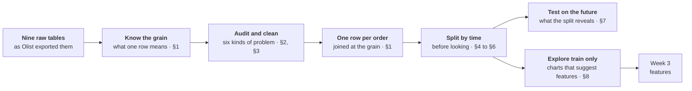

# Week 02 · Data quality & splitting

!!! abstract "At a glance"
    **Block:** 1 · Data & the Pipeline
    **Running example:** Olist orders. *Will this order arrive late?* New to it? Start with the [Block 1 overview](index.md).
    **Lab:** [`week-02/lab.ipynb`](https://github.com/evisp/ml-course-labs/blob/main/week-02/lab.ipynb) in the labs repository
    **Before class:** read sections 1, 4 and 5, about fifteen minutes

## Why this matters

> The test set lies most convincingly when nobody told it to.

Real data never arrives as one clean table. It arrives as several, each recorded by a different system, at a different grain, with its own gaps and mistakes. Joining them looks like plumbing. It is where some of the most expensive errors in this field are made, and none of them raise an error.

The second half of the week is about the split, the line between what a model learns from and what it is judged on. Draw that line in the wrong place and every score you report is flattering you. Last week's baselines looked one and a half times better than guessing. This week we find out how much of that was real.


*Each line joins a seller to a customer. The seller comes from one table, the customer from another, and the order that connects them from a third. Getting from three tables to one line is this week's work.*

## This week at a glance



Two halves. Sections 1 to 3 turn messy tables into one trustworthy table. Sections 4 to 8 decide what the model may learn from, and what it is judged on.

## Learning outcomes

By the end of this week you can:

- [ ] Say what one row means in any table, and test it in one line of code
- [ ] Join tables without silently adding or losing rows
- [ ] Audit data with a six-point checklist, and decide whether to fix, flag, or drop each problem
- [ ] Explain why cleaning must never learn from the data
- [ ] Choose between random, stratified, grouped, and time-based splits, and justify the choice
- [ ] Compare scores across splits fairly, using lift over the positive rate
- [ ] Explore the training data only, and turn each chart into a candidate feature

## Before class

!!! question "Bring an answer"
    A bank trains a fraud model on last year's transactions and tests it on a random 20% of the same year. The test score is excellent. Six months after launch, the model is much worse. Give one reason why, before reading any further.

---

## 1. Know the grain, and join at it

Every table has a **grain**: what one row stands for. One order. One item within an order. One payment. One visit to a zip code. The grain is decided by the system that recorded the data, and nobody writes it down.

The grain matters because of what happens when two tables with different grains are joined. If an order has three items and two payments, joining orders to items to payments produces **six rows** for that order, one for every pairing. No error appears. Counts are now wrong, averages are now weighted towards big orders, and a model trained on the result sees some orders six times and others once.

Two habits prevent all of this:

- **Test the grain before you trust it.** A set of columns identifies the grain if no combination of their values appears twice.
- **Bring every table to your target grain before joining it**, then check the row count after every join.

```python
def is_key(df, columns):
    return not df.duplicated(subset=columns).any()

def join_checked(left, right, **kwargs):
    joined = left.merge(right, how="left", **kwargs)
    assert len(joined) == len(left), f"join changed the rows: {len(left):,} to {len(joined):,}"
    return joined
```

!!! olist "In our example"
    | Table | One row is | Holds? |
    |---|---|---|
    | items | one item in an order: `order_id` + `order_item_id` | yes |
    | payments | one payment: `order_id` + `payment_sequential` | yes |
    | reviews | one review: `review_id` | **no**: 814 reviews are attached to more than one order |
    | geolocation | one zip code prefix | **no**: over a million rows for 19,015 prefixes |

    Joining orders, items, payments and reviews naively turns **96,204 orders into 114,521 rows**, with no warning.

    The fix: summarise items to one row per order (number of items and sellers, total price, freight and weight, plus the seller and category of the first item, since nine orders in ten have only one), do the same for payments, reduce geolocation to one point per zip code, and join everything with `join_checked`. The result is exactly 96,204 rows.

    One table is left out entirely: **94.7% of reviews are written on or after the delivery day**, so at the moment of purchase none of them exist. A whole table can leak.

*Elsewhere:* invoices and their line items, patients and their hospital visits, students and their exam attempts. Wherever one thing has many of another, a careless join multiplies rows.
{ .elsewhere }

!!! project "In your project"
    Write down the grain of every table you use, and test each one with `is_key`. Then decide your target grain, and summarise every table to it before joining.

## 2. Audit data quality with a checklist

A quality audit is not a vague look around. It is a checklist, applied to every table:

| Problem | What to look for |
|---|---|
| **Missing** | Gaps, and above all *why* they are there |
| **Impossible** | Values that cannot be true, such as events in the wrong order |
| **Inconsistent** | The same thing written several ways |
| **Duplicated** | The same row, or the same entity, more than once |
| **Out of range** | Values outside what is physically or logically possible |
| **Misnamed** | Columns or categories whose names mislead |

For every problem found, make one of three decisions, and write it down:

- **Fix** it, when the correct value is knowable
- **Flag** it, when the row is still useful but should be traceable
- **Drop** it, when the row cannot be trusted for your question

The right decision depends on the question, not on the problem. An impossible carrier date is harmless if the carrier date plays no part in your target or features. The same error is fatal if you are predicting how long the carrier takes.

!!! olist "In our example"
    | Problem | Finding | Decision |
    |---|---|---|
    | Missing | 610 products with no category | Fix: label them `unknown` |
    | Missing | 2 categories with no English name | Fix: translate by hand |
    | Impossible | 165 parcels handed to the carrier before purchase, 19 delivered before reaching the carrier | Flag: the carrier date is never used |
    | Inconsistent | 611 seller city spellings, such as `sao paulo / sao paulo` and `sp / sp` | Fix: normalise to 589 |
    | Duplicated | 261,831 identical rows in geolocation | Drop the copies |
    | Out of range | 33 Brazilian addresses with coordinates in Europe or the ocean | Drop those points |
    | Misnamed | Columns spelled `product_name_lenght` | Fix: rename at the source |

*Elsewhere:* in hospital records, a discharge before an admission is the same kind of impossible timeline. Whether to drop it depends on whether length of stay is part of the question.
{ .elsewhere }

!!! project "In your project"
    Run the six checks on every table. Build a findings table like the one above, with a decision and a one-line reason for each row. It goes straight into your report.

## 3. Make cleaning repeatable, and never learn while cleaning

Two rules turn cleaning from a chore into something you can trust.

**Cleaning is code, not editing.** Raw files are never changed by hand. Every fix is a step in a function that rebuilds the clean data from the raw files. If someone deletes every cleaned file, one command brings them back. If a fix was wrong, you change one line and rerun.

**Cleaning fixes facts. It never learns from the data.** Correcting a spelling, removing an exact duplicate, or relabelling a missing category as `unknown` are facts about each row, true however the data is split. Filling a missing weight with the median weight is different. The median is *learned* from the data, and anything learned must come from the training set only. Those steps belong inside a pipeline fitted after the split, which is Week 3.

!!! note "Key insight"
    **If a cleaning step would give a different answer on a different sample of the data, it is not cleaning. It is learning, and it waits until after the split.**

!!! olist "In our example"
    City names are cleaned by a function that looks only at the name in front of it:

    ```python
    def clean_city(name):
        name = unicodedata.normalize("NFKD", str(name)).encode("ascii", "ignore").decode()
        name = re.split(r"[/,\\]", name)[0]
        return " ".join(name.lower().split())
    ```

    `"Sao Paulo / SP"` and `"são paulo"` both become `"sao paulo"`. One seller typed a postcode, `04482255`, where the city should be. Nothing can recover the city from that, so it stays as it is.

    Every step of the audit lives in one function, `week_02()` in the labs repository, which rebuilds the whole clean table from the raw files in seconds. Two products with no weight stay missing: filling them would mean learning.

!!! project "In your project"
    Put every cleaning step in one function that reads the raw files and returns the clean table. Then go through it and mark any step that learns from the data. Move those out.

## 4. Split before you explore the target

There are two kinds of looking at data, and only one of them is safe before the split.

**Structural checks** ask about the data itself: types, gaps, duplicates, impossible values. They never look at the target, so running them on everything is fine. Sections 1 to 3 were all structural.

**Target exploration** asks which things go together with the answer: which regions, categories, or times are more often late. That is already learning from the labels. Do it on the full data, and what you see in the test rows shapes the features you build. The test set quietly stops being unseen.

So the order is always: **audit everything, split, then explore the target on the training set only.**

!!! olist "In our example"
    A confession. In Week 1 we charted lateness by state across all twenty months, test rows included. Fine for a first look at a problem, but from this week on, every chart involving `is_late` uses the training period only.

*Elsewhere:* a team explores the full dataset, notices that one hospital department has unusually high readmissions, and builds a feature for it. On unseen data the effect is weaker. Part of what they "discovered" was noise in the very rows they later tested on.
{ .elsewhere }

## 5. Choose the split that matches how the model will be used

The split is a promise about the future. It says: *the model will face data related to its training data in this way.* Choose the split by asking **who, or when, will the model be used on?**

| Split | Use it when | What goes wrong otherwise |
|---|---|---|
| **Random** | Rows are independent, and the future looks like the past | Nothing, if both are true |
| **Stratified** | One class is rare | A test set with almost no positives |
| **Grouped** | The model will face *new* people, patients, or shops | The same entity on both sides, so the model is tested on what it memorised |
| **Time-based** | The model will be used on *future* data | The model learns from the future it is tested on |

When more than one applies, use the strictest, and check the others. The [probability page](../06-reference/probability-statistics.md) explains the assumption behind each.

!!! olist "In our example"
    The model will predict for **future** orders, so the split is by time.

    Grouping matters too. 2,789 customers ordered more than once, and 1,743 orders share both a buyer and a day with another order: often one basket split by seller, with the same label 92% of the time. Near copies.

    | Split | Test orders whose buyer is also in training |
    |---|--:|
    | Random | 986 |
    | By time | 420 |
    | Grouped by customer | 0 |

    For our question, a returning customer next month is realistic, so a time split is right. But if the model were meant for brand-new customers, only the grouped split would give an honest score:

    ```python
    from sklearn.model_selection import GroupShuffleSplit

    splitter = GroupShuffleSplit(n_splits=1, test_size=0.2, random_state=42)
    train_idx, test_idx = next(splitter.split(df, groups=df["customer_unique_id"]))
    ```

*Elsewhere:* a model predicting exam results for next year's students should be split by year. One meant for students at a new school should be split by school.
{ .elsewhere }

!!! project "In your project"
    Answer in one sentence: who, or when, will your model be used on? Choose your split from that sentence, and write the sentence in your problem card.

## 6. Train, validation, and test

Three parts, three jobs:

| Part | Job | How often you look |
|---|---|---|
| **Train** | The model learns from it. You explore it. | As often as you like |
| **Validation** | You compare options and make choices: which features, which model, which settings | Often |
| **Test** | One final, honest estimate of how the chosen model will do | Once, at the end |

Every time you make a choice based on a score, that score becomes slightly optimistic, because you picked the option that happened to do well on that data. That is why choices are made on validation, and test is kept for the end. Look at test repeatedly, and it becomes a second validation set that flatters you.

With a time-based split, the three parts come in time order: train on the oldest data, validate on what comes next, test on the most recent.

!!! olist "In our example"
    
    

    *Three periods, three different worlds. Validation catches the spike of early 2018. Test covers the calm that followed.*

    | Part | Purchased | Orders | Late |
    |---|---|--:|--:|
    | Train | January 2017 to February 2018 | 57,051 | 6.6% |
    | Validation | March and April 2018 | 13,801 | 11.8% |
    | Test | May to August 2018 | 25,352 | 4.4% |

!!! warning "Validation and test can disagree, and that is information"
    A model chosen because it did best on the spike of early 2018 may be tuned to a crisis that has already passed. When validation and test disagree, the world changed between them. A random split would have hidden that from you.

## 7. What a time-based split reveals

A time-based split often tells you something unwelcome: a model that looked good was partly memorising the period it was tested on. Two things to know when reading the scores.

**The floor moves.** The no-skill PR AUC equals the positive rate, and the positive rate changes between periods. A PR AUC of 0.19 on validation (11.8% positive) and 0.05 on test (4.4% positive) cannot be compared directly.

**Compare lift instead.** Lift is the score divided by the positive rate: how many times better than guessing. A lift of 1 is no better than chance, whatever the period.

!!! olist "In our example"
    Week 1's rule and tree, judged three ways:

    
    

    | | Positive rate | Rule PR AUC | Tree PR AUC | Rule lift | Tree lift |
    |---|--:|--:|--:|--:|--:|
    | Random split | 6.8% | 0.102 | 0.102 | 1.51 | 1.50 |
    | Time: validation | 11.8% | 0.186 | 0.195 | 1.57 | 1.65 |
    | Time: test | 4.4% | 0.048 | 0.052 | **1.10** | **1.18** |

    On the random split, both baselines look one and a half times better than guessing. Trained on the past and judged on the most recent months, they are barely better than guessing at all. Nothing about the models changed. Only the question asked of them.

!!! note "Key insight"
    **A random split answers "does this pattern exist in my data?" A time-based split answers "will this pattern still hold next month?"** Only the second is the question a deployed model faces.

!!! project "In your project"
    If your data has any time dimension, score your Week 1 baselines on a random split and on a time-based split, and report both, with lift. The gap between them is a finding, not an embarrassment.

## 8. Explore the training data

Exploratory analysis is not decoration. Each chart should answer one question, and end with a decision: **what feature does this suggest, or rule out?**

A good rhythm for every chart:

1. Write down what you expect *before* you look
2. Draw it, on the training data only
3. Write one sentence on what it shows
4. Name the feature it suggests, or say plainly that it suggests none

A chart that says *not this* is still useful. It saves you from building a feature that will not help.

!!! olist "In our example"
    
    

    *Customers' locations, coloured by late rate. Lateness clusters along the northeastern coast and around Rio, and neighbouring cells can differ a lot: location matters at a finer level than the state.*

    
    

    *Olist promises about 25 days and usually delivers in 11: 82% of orders arrive a week or more early. The promise is padded, so a late order is one where something went wrong beyond the usual.*

    
    

    *Orders crossing a state border are late almost twice as often. The strongest single pattern so far, computed in one line.*

    The lab has two more charts. **When Brazil shops** shows a striking weekly rhythm, peaking on Tuesday afternoons, but the late rate barely moves with the hour: 5.7% to 7.5% across the busy hours. The 3.8% at three in the morning comes from only 158 orders. And **categories** differ modestly, from about 5% for housewares to 9% for baby products, across more than seventy categories.

    What the charts point to for Week 3:

    | Chart | Feature suggested |
    |---|---|
    | Brazil map | Distance between seller and customer |
    | Promised versus actual | The promise compared with a typical delivery for that route |
    | Within or across states | `same_state`, directly |
    | When Brazil shops | None: the pattern is striking but does not predict lateness |
    | Categories | The category, encoded carefully, since it has many values |

*Elsewhere:* in churn prediction, a chart of churn by signup month often shows a spike after a price change: a feature idea, and a warning that the future may not look like the past.
{ .elsewhere }

!!! project "In your project"
    Draw at least four charts on your training data, following the four-step rhythm. End with a table like the one above: chart, what it shows, feature suggested.

---

## Lab

!!! example "Lab · `week-02/lab.ipynb`"
    In the [labs repository](https://github.com/evisp/ml-course-labs). This week you write most of the code yourself. It runs longer than one session on purpose: parts 5 to 7 make good homework.

    1. `git pull`, open `week-02/lab.ipynb`, and save your own copy as `my-lab.ipynb`
    2. Profile every table and test its grain
    3. Audit: categories, city names, duplicate and impossible coordinates, impossible timelines
    4. Watch the naive join multiply rows, then build one row per order with `join_checked`
    5. Split by time, and draw the split on the monthly late rate
    6. Explore the training data in five charts, each ending with a feature
    7. Rerun Week 1's ladder on both splits, and count buyers on both sides

    **Check cells** confirm each step. Every chart ends with a question that only you can answer.

## Project step

!!! project "For your Project 1 dataset"
    - Record the grain of every table, tested with `is_key`
    - Run the six-point audit and write the findings table, with a decision for each row
    - Put every cleaning step in one function that rebuilds the clean data from the raw files
    - Choose your split from one sentence about who or when the model will be used on
    - Score your baselines on a random split and on your chosen split, with lift
    - Draw four charts on the training data, and end with a table of suggested features

## Common mistakes

!!! warning "What goes wrong in week two"
    - **Joining without knowing the grain.** Rows multiply, and nothing complains.
    - **Editing raw files by hand.** The fix cannot be repeated, reviewed, or undone.
    - **Filling gaps with learned values during cleaning.** A median computed on all the data has already seen the test set.
    - **Exploring the target before splitting.** The test set shapes the features, and stops being unseen.
    - **A random split for a model that will face the future.** Scores that will not survive launch.
    - **Comparing raw PR AUC across periods.** The floor moves with the positive rate. Compare lift.
    - **Looking at the test set to make choices.** It becomes a second validation set, and flatters you.

## Check yourself

??? question "A join of orders and payments returns more rows than there are orders. What happened, and what is the fix?"
    Some orders have more than one payment, so each order row is repeated once per payment. Summarise payments to one row per order first, for example total paid and number of payments, then join, and check the row count.

??? question "You fill missing product weights with the median weight of all products, before splitting. Why is that a problem?"
    The median is learned from the data, including the rows that end up in the test set, so test information has leaked into training. Filling belongs inside a pipeline fitted on the training data only.

??? question "Why did Olist's baselines drop from about 1.5 times better than guessing to about 1.1 to 1.2?"
    The random split let the model learn from the same months it was tested on. The time split asks whether patterns from the past still hold in the future, and for last week's features they mostly do not.

??? question "Validation PR AUC is 0.19 and test PR AUC is 0.05. Is the model much worse on test?"
    Not necessarily. The positive rate is 11.8% in validation and 4.4% in test, so the floor moved. Compare lift: 1.65 against 1.18. Worse, but by far less than the raw numbers suggest.

??? question "You are predicting which patients will miss appointments, for a clinic that will use it on new patients. Which split, and why?"
    A grouped split by patient, so no patient appears in both training and test. Otherwise the model can recognise returning patients rather than learning what predicts missed appointments. If the data spans a long period, split by time as well, and check that the groups do not cross.

## Quick reference

| Idea | In one line |
|---|---|
| Grain | What one row stands for. Test it with `is_key`. |
| Safe join | Summarise to the target grain, join, check the row count |
| Audit | Missing, impossible, inconsistent, duplicated, out of range, misnamed |
| Decisions | Fix, flag, or drop, depending on the question |
| Cleaning rule | Fixes facts. Anything learned waits until after the split. |
| Split choice | Future data: time. New entities: grouped. Rare class: stratified. |
| Lift | PR AUC divided by the positive rate. 1 means guessing. |

```python
df.duplicated(subset=["order_id", "order_item_id"]).any()     # test a grain
items.groupby("order_id").agg(n_items=("order_item_id", "size"))   # summarise to the grain
df.loc[df["order_purchase_timestamp"] < "2018-03-01", "split"] = "train"   # split by time
average_precision_score(y, scores) / y.mean()                  # lift
```

## Summary

Nine tables became one clean row per order. On the way, a naive join added over eighteen thousand rows without a word, a quarter of a million duplicate rows and thirty-three misplaced addresses were removed, and one whole table was set aside because it only exists after the event we want to predict. Every fix lives in a function, and none of them learns from the data. Then the split: by time, because the model will face the future, and drawn before any exploration of the target. Judged that way, last week's baselines were barely better than guessing. The charts on the training data point to what might do better.

**Next week** builds those features: distance, same state, the promise against a typical delivery, and the category, inside a pipeline that cannot leak.

**Next:** [Week 03 · Feature engineering](week-03-feature-engineering.md)

## Resources

- [Hadley Wickham, Tidy Data](https://www.jstatsoft.org/article/view/v059i10). The classic paper on what a clean table looks like, and why grain matters.
- [scikit-learn, Cross-validation iterators](https://scikit-learn.org/stable/modules/cross_validation.html#cross-validation-iterators). Every splitter in this page, with pictures of how each divides the data.
- [Rob Hyndman, Time series cross-validation](https://robjhyndman.com/hyndsight/tscv/). A short, clear explanation of why time changes everything about splitting.
- [Probability and statistics](../06-reference/probability-statistics.md) on this site, for the assumptions behind each split.

!!! quote
    Draw the line between past and future before you look at either.
