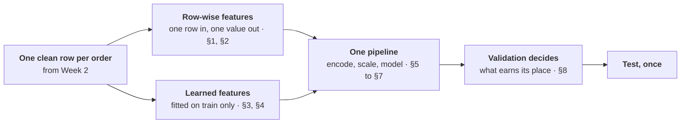
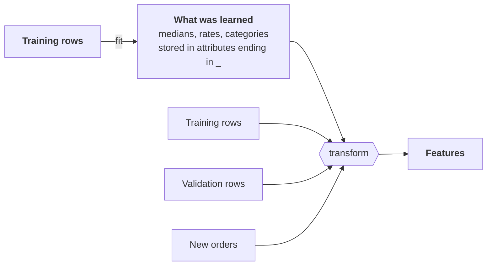

# Week 03 · Feature engineering

!!! abstract "At a glance"
    **Block:** 1 · Data & the Pipeline
    **Running example:** Olist orders. *Will this order arrive late?* New to it? Start with the [Block 1 overview](index.md).
    **Lab:** [`week-03/lab.ipynb`](https://github.com/evisp/ml-course-labs/blob/main/week-03/lab.ipynb) in the labs repository
    **Before class:** read sections 1, 3 and 5, about fifteen minutes

## Why this matters

> Good features beat clever algorithms. A leaky feature beats nothing at all, until the day it meets real data.

Last week ended badly. Judged on the future, Week 1's baselines were barely better than guessing. The model was never the problem: the features were. This week you build better ones, from what exists at the moment of prediction, and you build them inside a structure that makes leaking hard to do by accident.

Two things make this week different from simply "adding columns". Some features are computed from a single row and are safe anywhere. Others are learned from many rows, and those are where the quietest leaks in machine learning live. Telling the two apart is most of the skill.


*Where this week ends up: judged once on the future months, the Week 3 model is 1.87 times better than guessing, against 1.10 and 1.18 for Week 1's baselines.*

## This week at a glance



Sections 1 to 4 are about building features safely. Sections 5 to 7 put them into one pipeline with the model. Section 8 decides which ones stay.

## Learning outcomes

By the end of this week you can:

- [ ] Tell a row-wise feature from a learned one, and say which can leak
- [ ] Build features from what exists at the moment of prediction
- [ ] Spot a statistic computed over the whole dataset, and fix it
- [ ] Write a scikit-learn transformer with `fit` and `transform`
- [ ] Put preprocessing and model into one pipeline with a `ColumnTransformer`
- [ ] Choose an encoding for a category based on how many values it has
- [ ] Decide when scaling matters, and read a scaled model's coefficients
- [ ] Judge each feature on validation, and look at test exactly once

## Before class

!!! question "Bring an answer"
    A music app predicts whether you will skip a song. It could use "how often *you* skip songs" or "how often *everyone* skips this song". Which of those two needs more care when you build it, and why?

---

## 1. Know the two kinds of feature

Every feature you will ever build is one of two kinds, and the difference decides whether it can leak.


**Row-wise** features are computed from one row on its own: a distance, a ratio, a flag, the day of the week. The value for a row is the same whether that row lands in training or in test. They cannot leak through the split, so you can build them before or after it.

**Learned** features are computed from many rows: an average, a typical value, a rate per category. The value for a row depends on *which other rows* were used. If those include test rows, the feature carries information from the test set into training. Learned features must be computed from training rows only, after the split.

!!! note "Key insight"
    **Ask of every feature: could its value change if I split the data differently?** If yes, it is learned, and it belongs after the split, fitted on training rows only.

!!! olist "In our example"
    | Feature | Kind |
    |---|---|
    | Distance from seller to customer | Row-wise |
    | Same state or not | Row-wise |
    | Days promised | Row-wise |
    | Freight as a share of price | Row-wise |
    | Typical delivery time on this route | Learned |
    | The seller's late rate | Learned |
    | The category's late rate | Learned |

*Elsewhere:* in credit scoring, "this applicant's debt divided by their income" is row-wise. "How this applicant's income compares with the average in their region" is learned.
{ .elsewhere }

!!! project "In your project"
    List every feature you plan to build, and label each one row-wise or learned. The learned ones get extra care for the rest of this week.

## 2. Build features from what exists at prediction time

Good features usually come from understanding the problem, not from clever transformations. A few families cover most of what you will need:

| Family | Examples |
|---|---|
| **Distances and differences** | Kilometres between two points, days between two dates |
| **Ratios** | Cost per unit, debt per income, freight per price |
| **Flags** | Same region or not, first order or not, weekend or not |
| **Parts of dates** | Weekday, month, hour, days until a holiday |
| **Counts and totals** | Items in a basket, visits in the last month |

Every one must pass Week 1's test: **does this value exist at the moment of prediction?**

Before any model, test each new feature on its own. Use it alone as a score and measure its lift on validation. A feature that says nothing alone may still help in combination, but a quick look tells you where the signal is.

!!! olist "In our example"
    Four row-wise features, each from one row: `distance_km` (using the haversine formula, the straight-line distance on a sphere), `same_state`, `window_days`, and `freight_ratio`. The typical order travels about 450 km, a third stay within one state, and freight costs about a fifth of the price.

    
    

    *Distance says the most on its own. Weight, price, basket size, and the length of the promise say almost nothing alone. Section 7 shows why "alone" is not the whole story.*

*Elsewhere:* for predicting whether a flight is delayed, the distance of the route, the hour of departure, and whether it is the last flight of the day are all row-wise and all available at booking.
{ .elsewhere }

!!! project "In your project"
    Build at least three row-wise features from your domain, and test each one alone on validation. Keep the table: it is a useful record of where the signal is.

## 3. Fit learned features on training data only

The quietest leak in machine learning is **a statistic computed over the whole dataset**. It looks like good practice: more data, more reliable averages. But if the average for a group includes test rows, then each test row's own answer is already inside the feature it is judged with.

The rule is short: **anything learned from many rows is learned from the training rows, and only applied to the others.**

!!! olist "In our example"
    Some sellers are late far more often than others, so a seller's late rate sounds like an excellent feature. The only question is which orders it is computed from.

    
    

    *The same feature, scored on the same validation orders. The only difference is where the rate was computed.*

    Computed from all orders, validation orders' own labels sit inside their sellers' averages, and the feature scores 1.89. Computed honestly, from training orders only, it scores 1.21.

!!! danger "It looks like a good feature"
    No error, no warning, and a score that improves. This is the leak Week 1 promised: much quieter than using the delivery date, and much easier to make.

*Elsewhere:* a hospital builds "readmission rate of this doctor" from all its records, test patients included. The feature looks powerful in evaluation and disappoints on new patients.
{ .elsewhere }

!!! project "In your project"
    For every learned feature, write down which rows it is computed from. If the answer is anything other than "training rows only", fix it before going further.

## 4. Transformers: fit learns, transform applies

The fix for learned features is not a trick. It is a pattern, and every preprocessing step in scikit-learn follows it. A **transformer** has two methods:

- **`fit`** learns something from training data and stores it, in attributes whose names end with an underscore
- **`transform`** applies what was learned, to any data



Learning happens once, on training data. Applying happens everywhere. `fit_transform` is a shortcut for both on the same data, which is exactly why it is only ever called on training data.

There is one more rule, and it matters most: **`fit` may look at the past, including outcomes, because it only sees training data. `transform` may only use what exists at the moment of prediction**, because it will run on new cases where the outcome has not happened yet.

!!! olist "In our example"
    Olist pads its promises, so a useful question is how much slack a promise leaves compared with the typical delivery time on that route. The typical time must be learned, so it goes in `fit`:

    ```python
    class RouteSlack(BaseEstimator, TransformerMixin):
        def fit(self, X, y=None):
            days_taken = (X["order_delivered_customer_date"].dt.normalize()
                          - X["order_purchase_timestamp"].dt.normalize()).dt.days
            route = X["seller_state"] + " > " + X["customer_state"]
            self.typical_days_ = days_taken.groupby(route).median()     # learned from the past
            self.overall_days_ = days_taken.median()
            return self

        def transform(self, X):
            route = X["seller_state"] + " > " + X["customer_state"]
            typical = route.map(self.typical_days_).fillna(self.overall_days_)
            promised = (X["order_estimated_delivery_date"]
                        - X["order_purchase_timestamp"].dt.normalize()).dt.days
            return pd.DataFrame({"slack_days": promised - typical}, index=X.index)   # no delivery date here
    ```

    Fitted on training orders, it learns 369 routes. A typical São Paulo to Rio parcel takes 13 days, and the median promise leaves 11 days of slack beyond the typical trip.

*Elsewhere:* a transformer that learns the typical price per square metre in each neighbourhood, from past sales, and then computes how a new listing's asking price compares with it.
{ .elsewhere }

!!! project "In your project"
    Write at least one learned feature as a transformer class. Check two things: `fit` stores everything it learns in attributes ending in `_`, and `transform` never reads a column that would not exist at prediction time.

## 5. Pipelines make leakage structurally impossible

Doing each step by hand is how leaks creep in. One `fit` on the wrong data is enough, and it is easy to make in a long notebook. A **pipeline** removes the chance. It holds every preprocessing step and the model in one object:

- `pipeline.fit(train)` fits every step, in order, on training data only
- `pipeline.predict(anything)` applies every step using only what was learned during fit

Different columns need different treatment, so a `ColumnTransformer` routes each group of columns to its own steps and joins the results.

!!! olist "In our example"
    ```mermaid
    flowchart LR
        D["<b>Order table</b>"] --> CT
        subgraph CT["ColumnTransformer"]
            direction TB
            NUM["<b>8 numbers</b><br/>fill gaps with the median, then scale"]
            ST["<b>2 states</b><br/>one-hot encode"]
        end
        CT --> M["<b>Logistic regression</b>"]
        M --> P["<b>Probability of arriving late</b>"]
    ```

    ```python
    numeric = Pipeline([("impute", SimpleImputer(strategy="median")), ("scale", StandardScaler())])

    prep = ColumnTransformer([
        ("numeric", numeric, ROW_WISE),
        ("states", OneHotEncoder(handle_unknown="ignore"), ["customer_state", "seller_state"]),
    ])

    model = Pipeline([("prep", prep), ("model", LogisticRegression(max_iter=2000, class_weight="balanced"))])
    model.fit(train, train["is_late"])
    ```

    Validation lift **2.34**, against 1.57 and 1.65 for Week 1's baselines on the same data. The imputer's medians and the scaler's means were learned from training orders, inside the pipeline, without a single line of code that could have used the wrong rows.

*Elsewhere:* a pipeline is also what you deploy. Save the fitted pipeline, and a new record goes in raw and comes out as a prediction, transformed with exactly the statistics the model was trained with.
{ .elsewhere }

!!! project "In your project"
    Put every preprocessing step and your model into a single pipeline. A good test: your notebook should contain no call to `fit` or `fit_transform` outside the pipeline.

## 6. Encode categories by how many values they have

Models need numbers, so every category has to be encoded. The right encoding depends mostly on how many different values the column has:

| Values | Encoding | Watch out for |
|---|---|---|
| **A handful** | One-hot: one column per value | Nothing much. The default. |
| **Many** | Target encoding: each value becomes the average target for that value | Must be cross-fitted, or the model trusts it far too much |
| **An ID per entity** | Often better left out | Thousands of values, most seen only a few times |
| **Free text** | Word counts or TF-IDF, which turn words into weighted counts | Only text that exists at prediction time |

**Target encoding** is a learned feature, so it must come from training rows. But there is a second trap. If each *training* row is encoded with an average that includes its own label, the model sees a feature that is partly the answer, and learns to trust it far too much. The fix is **cross-fitting**:


scikit-learn's `TargetEncoder` does this for you inside `fit_transform`, which is one more reason to keep it in a pipeline.

!!! olist "In our example"
    States have 27 values, so they are one-hot encoded. Sellers have almost 3,000. Encode them naively, with rates computed on the same training rows, and compare with cross-fitting:

    
    

    *Naive encoding looks brilliant on training data, 3.97, and falls to 1.74 on validation. Cross-fitting gives a lower training score and a higher validation score: the gap shrinks because the model is no longer fooled by its own labels.*

    Olist has no text that exists at the moment of purchase: the only free text is in reviews, which are written after delivery. So there is no TF-IDF in this week's model. The [scikit-learn cheatsheet](../06-reference/sklearn-cheatsheet.md) shows how to use it when your data has text.

*Elsewhere:* a postcode with 20,000 values, a product ID, a doctor's name. All tempting, all high-cardinality, and all worth asking whether the model can really learn from them.
{ .elsewhere }

!!! project "In your project"
    Count the distinct values in each categorical column. Choose one-hot, cross-fitted target encoding, or leaving it out, and write one line explaining each choice.

## 7. Scale when the model cares

Some models are sensitive to the scale of their inputs, and some are not:

| Model | Needs scaling? | Why |
|---|---|---|
| Logistic and linear regression | Yes | Trained by gradient steps, which struggle when features differ wildly in scale |
| Anything based on distances | Yes | A feature in thousands would drown out one in units |
| Decision trees and their ensembles | No | They split on thresholds, and a threshold does not care about units |

The [calculus page](../06-reference/calculus.md) shows what goes wrong for gradient descent when features are badly scaled. There is a second reward: once every feature is on the same scale, the **coefficients of a linear model become comparable**, and the model becomes readable.

!!! olist "In our example"
    Without the scaler, logistic regression runs out of steps before it finds its best weights: it stops with a convergence warning, and validation lift drops from 2.34 to 2.28. Scaled, the coefficients tell a clear story:

    
    

    *A longer promise pushes hardest towards on time. Distance pushes towards late, and staying within one state towards on time.*

    Look at `window_days`. On its own, in section 2, it was the weakest feature. In the model, it has the strongest coefficient. A long promise only means something once the model also knows how far the parcel travels. **Useless alone does not mean useless in a model.**

!!! project "In your project"
    If you use a linear model, scale its numeric inputs inside the pipeline, then plot the coefficients. If any of them contradicts what you know about the domain, find out why before trusting the score.

## 8. A feature must earn its place

More features are not automatically better. Each one adds a way to overfit, a column to maintain, and a possible leak. So every candidate has to earn its place, with a simple protocol:

1. Start from a solid base model
2. Add **one** candidate, or one group, at a time
3. Judge each on **validation**, never on test
4. Keep only what clearly helps
5. When every decision is made, score the final model on **test, once**

!!! olist "In our example"
    Three learned candidates on top of the row-wise model, plus the same features in a tree:

    
    

    *None of the learned features clearly beats the plain row-wise model. The category ties, the route slack and the seller make validation worse, and the tree loses on the same features.*

    The simplest model wins, so it is the one we keep. Then, and only then, one look at test: a lift of **1.87**, against 1.10 and 1.18 for Week 1's baselines on the same future months. Lower than the 2.34 on validation, as Week 2 led us to expect, since the test months are calmer. But the gain is real, and it held on data nobody looked at while choosing.

!!! note "Key insight"
    **A clever feature that loses on validation is a lesson, not a failure.** You know the simpler model is better because you tested it on data it never saw, not because it felt right.

*Elsewhere:* a churn team adds forty engineered features and gains nothing on validation. The honest report says so, and ships the model with eight. It is easier to explain, cheaper to run, and just as good.
{ .elsewhere }

!!! project "In your project"
    Run the protocol: a base model, then each candidate on its own, judged on validation. Report every result, including the features that lost, then score the chosen model on test once.

---

## Lab

!!! example "Lab · `week-03/lab.ipynb`"
    In the [labs repository](https://github.com/evisp/ml-course-labs). You write most of the code yourself, and it runs longer than one session on purpose: parts 5 to 7 make good homework.

    1. `git pull`, open `week-03/lab.ipynb`, and save your own copy as `my-lab.ipynb`
    2. Write the haversine distance and the four row-wise features, and test each one alone
    3. Compute the seller's late rate two ways, and see the leak
    4. Write `RouteSlack`, your own transformer
    5. Build the `ColumnTransformer` and pipeline
    6. Compare naive and cross-fitted target encoding
    7. Remove the scaler, then chart and read the coefficients
    8. Judge each addition on validation, and score the chosen model on test once

## Project step

!!! project "For your Project 1 dataset"
    - Label every planned feature row-wise or learned
    - Build at least three row-wise features, and test each one alone on validation
    - Write at least one learned feature as a transformer, fitted on training data only
    - Put all preprocessing and the model into one pipeline, with a `ColumnTransformer`
    - Choose an encoding for each categorical column, with a one-line reason
    - Judge each candidate addition on validation, then score the final model on test once

## Common mistakes

!!! warning "What goes wrong in week three"
    - **Computing an average over all the data.** A statistic that includes test rows leaks, and looks like a great feature.
    - **Calling `fit_transform` on validation or test.** Only ever `transform` them.
    - **Target encoding without cross-fitting.** The model trusts the feature far too much, and falls apart on new data.
    - **A `transform` that reads future columns.** It works in the notebook and breaks in deployment.
    - **Forgetting to scale for a linear model.** A convergence warning, and coefficients you cannot compare.
    - **Keeping a feature because it is clever.** Keep it because it wins on validation.
    - **Choosing features by looking at test.** Then the test score is no longer honest.

## Check yourself

??? question "Is 'days between purchase and the promised date' row-wise or learned? And 'the average of that across all orders from the same seller'?"
    The first is row-wise: it comes from one order's two dates. The second is learned: it depends on which of the seller's orders are included, so it must be computed from training orders only.

??? question "The seller's late rate scored 1.89 when computed on all orders, and 1.21 on training orders only. Where did the extra 0.68 come from?"
    From the validation orders themselves. When the rate includes all orders, each validation order's own label is inside its seller's average, so the feature partly contains the answer it is judged against.

??? question "Why does naive target encoding score so much higher on training data than on validation?"
    Each training row is encoded with an average that includes its own label, so on training rows the feature is partly the answer, and the model learns to lean on it. On new rows that is no longer true. Cross-fitting encodes each row from the other folds only.

??? question "Your transformer's `fit` reads the delivery date. Is that a leak?"
    Not by itself. `fit` only sees training orders, which are in the past, so learning typical delivery times from them is fine. It would leak if `transform` read the delivery date, since at the moment of prediction the delivery has not happened.

??? question "You predict house prices with a decision tree. Do you need to scale the features? Would your answer change for linear regression?"
    Not for the tree: it splits on thresholds, which do not depend on units. For linear regression, yes: scaling helps the fitting, and it is the only way to compare the coefficients.

## Quick reference

| Idea | In one line |
|---|---|
| Row-wise feature | From one row. Safe before or after the split. |
| Learned feature | From many rows. Fitted on training rows only. |
| The leak test | Could this value change if I split the data differently? |
| Transformer | `fit` learns and stores, `transform` applies. `fit` may see the past, `transform` only the present. |
| Pipeline | Every learned step, and the model, in one object. `fit` once, on train. |
| Encoding | A few values: one-hot. Many: cross-fitted target encoding. IDs: often leave out. |
| Scaling | Linear and distance-based models: yes. Trees: no. |
| Earning a place | One addition at a time, judged on validation. Test once. |

```python
ColumnTransformer([
    ("numeric", Pipeline([("impute", SimpleImputer(strategy="median")), ("scale", StandardScaler())]), numeric_cols),
    ("few", OneHotEncoder(handle_unknown="ignore"), few_value_cols),
    ("many", TargetEncoder(random_state=42), many_value_cols),
])
```

## Summary

Features come in two kinds. Row-wise features, built from one row, are safe anywhere. Learned features, built from many rows, must be learned from training rows only, and a statistic computed over the whole dataset is the quietest leak there is. The transformer pattern, `fit` to learn and `transform` to apply, and the pipeline that holds every step together, make that rule hard to break by accident. Categories are encoded according to how many values they have, with cross-fitting for target encoding, and linear models are scaled so they train properly and can be read. Then each feature earns its place on validation. Here the simplest features won, and the model they built held up once on the future: a test lift of 1.87, up from 1.10.

**Next week** asks what that number hides: at which threshold we should act, which orders the model gets wrong, and whether it fails some customers far more than others.

**Next:** [Week 04 · Evaluation & error analysis](week-04-evaluation.md)

## Resources

- [scikit-learn, Pipelines and composite estimators](https://scikit-learn.org/stable/modules/compose.html). The official guide to `Pipeline` and `ColumnTransformer`.
- [scikit-learn, Target Encoder](https://scikit-learn.org/stable/modules/preprocessing.html#target-encoder). How cross-fitting works inside `TargetEncoder`.
- [scikit-learn, Common pitfalls](https://scikit-learn.org/stable/common_pitfalls.html). Short, and almost entirely about the leaks in this page.
- [scikit-learn cheatsheet](../06-reference/sklearn-cheatsheet.md) on this site, for every pattern above in one place.

!!! quote
    Learn from the past, apply to the present, and let validation decide what stays.
