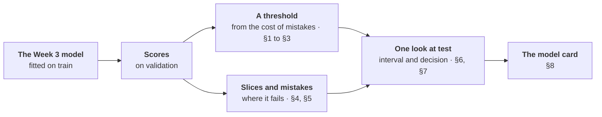
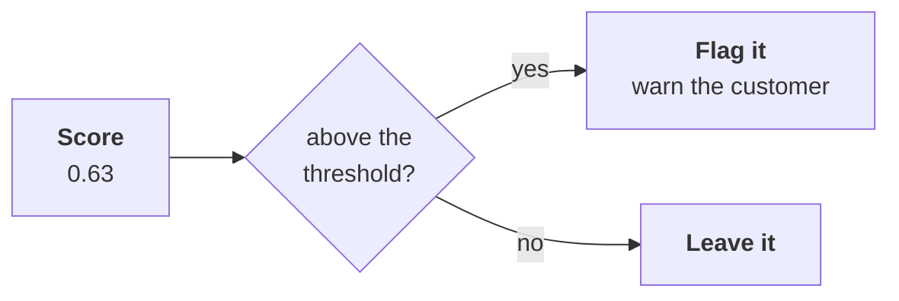
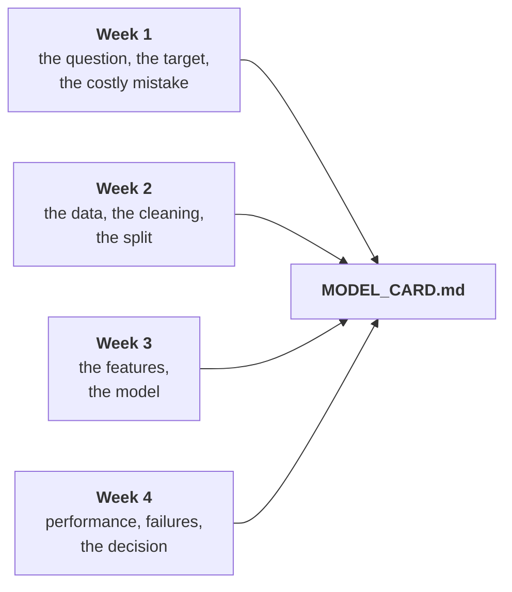

# Week 04 · Evaluation & error analysis

!!! abstract "At a glance"
    **Block:** 1 · Data & the Pipeline
    **Running example:** Olist orders. *Will this order arrive late?* New to it? Start with the [Block 1 overview](index.md).
    **Lab:** [`week-04/lab.ipynb`](https://github.com/evisp/ml-course-labs/blob/main/week-04/lab.ipynb) in the labs repository
    **Before class:** read sections 1, 2 and 7, about fifteen minutes

## Why this matters

> A model that ranks well can still make a bad decision.

A single score, however honest, is a summary, and every summary hides something. It hides the threshold someone will use to act on the model. It hides what a mistake costs. It hides which customers the model fails, how uncertain the number itself is, and whether the decision built on it will still make sense next month.

This week you look at everything the score hides. By the end you will have evaluated a model the way it would need to be evaluated before anyone relied on it, and written the document that says so.


*The same model, the same threshold, chosen carefully. In one period it cut the cost of mistakes by 43%. In the next, it cost more than doing nothing. This week explains why.*

## This week at a glance



Sections 1 to 5 all happen on validation. Test waits for sections 6 and 7, and we look at it once. Section 8 writes it all down.

## Learning outcomes

By the end of this week you can:

- [ ] Explain why a score is not a decision, and what a threshold trades
- [ ] Choose a threshold from the cost of each kind of mistake, and compute break-even precision
- [ ] Check whether scores can be read as probabilities
- [ ] Break a model's performance down by slice, and say who it fails
- [ ] Turn individual mistakes into hypotheses for the next version
- [ ] Report a score with an honest interval, and compare two models fairly
- [ ] Explain why a decision can fail when the world changes, and what to monitor
- [ ] Write a model card

## Before class

!!! question "Bring an answer"
    A test for a disease catches 95% of people who have it. Is that a good test? Write down one more thing you would need to know before answering.

---

## 1. A score is not a decision

A classifier does not say *yes* or *no*. It gives each case a score, and someone has to decide what to do with it. The simplest decision is a **threshold**:



Every threshold is a different trade. Lower it, and more cases are flagged: recall rises, since fewer positives slip through, and precision usually falls, since more flags are wrong. Raise it, and the reverse. There is no threshold that is right in general. There is only a threshold that is right for a particular decision, with particular costs.

And like every choice, the threshold is made on **validation**, never on test.

!!! olist "In our example"
    
    

    *As the threshold rises, fewer orders are flagged, recall falls, and precision climbs. At the right edge, almost nothing is flagged at all.*

    | Threshold | Orders flagged | Precision | Recall |
    |:--:|--:|--:|--:|
    | 0.5 | 33% | 23% | 64% |
    | 0.6 | 19% | 28% | 46% |
    | 0.7 | 9% | 37% | 26% |
    | 0.8 | 1% | 36% | 4% |

*Elsewhere:* a spam filter and a fraud alarm can use the same kind of model and opposite thresholds. A spam filter must rarely flag a real email. A fraud alarm must rarely miss a real fraud.
{ .elsewhere }

!!! project "In your project"
    Plot precision and recall against the threshold on validation. Then write down, before choosing, which kind of mistake your problem can least afford.

## 2. Choose the threshold from the cost of mistakes

The data cannot tell you which threshold is right. The costs can. Put a number on each kind of mistake, then choose the threshold that makes the total cheapest:

\[
\text{cost per case} = \frac{\text{cost of a miss} \times \text{misses} \; + \; \text{cost of a false alarm} \times \text{false alarms}}{\text{number of cases}}
\]

Compare it with the two simplest policies: flag nothing, and flag everything. A model is only worth using if it beats both.

One number follows directly from the costs, and it is worth remembering. Flagging a case pays only if the chance it is really positive is above

\[
\text{break-even precision} = \frac{\text{cost of a false alarm}}{\text{cost of a miss}}
\]

Below that, every flag costs more than it saves, however good the model is.

!!! olist "In our example"
    The Week 1 problem card said missing a late order is the costly mistake. Say a **miss costs 10** (an angry customer, perhaps a bad review) and a **false alarm costs 1** (one message sent for nothing). These are business assumptions, not facts: a real team would agree them with the people who pay for each mistake.

    
    

    *The cheapest threshold on validation is 0.48.*

    | Policy | Cost per order |
    |---|--:|
    | Flag nobody | 1.18 |
    | Flag everybody | 0.88 |
    | **The model at 0.48** | **0.67** |

    A saving of 43% against doing nothing. The break-even precision is 1 / 10 = **10%**, and at 0.48 the model's flags are right 22% of the time, comfortably above it.

*Elsewhere:* in screening for a serious disease, a miss can cost a life and a false alarm costs a second test. The ratio is so large that the threshold goes very low, and screening programmes accept many false alarms on purpose.
{ .elsewhere }

!!! project "In your project"
    Agree a cost for each kind of mistake, and write down where the numbers come from. Choose your threshold on validation by minimising cost, compare with flag-nothing and flag-everything, and compute your break-even precision.

## 3. Scores are not probabilities

It is tempting to read a score of 0.8 as "80% chance". Test it before you do. Group cases by score, and compare the average score in each group with how often those cases were really positive. A model whose scores are probabilities lands on the diagonal. This is called a **reliability diagram**, and a model on the diagonal is **calibrated**.

Many models are not, for ordinary reasons. Weighting classes to handle imbalance pushes scores up. Resampling does the same. Some model families are overconfident by nature. None of this hurts ranking, and none of it hurts a threshold chosen on validation, because both only use the *order* of the scores. It only hurts someone who reads a score as a chance.

!!! olist "In our example"
    
    

    *Far below the diagonal. The average score on validation is 0.47, while only 12% of orders are late. Orders scored above 0.8 are late only 36% of the time.*

    The cause is `class_weight="balanced"` from Week 3. It helped the model rank the rare late orders, and pushed every score upwards.

!!! warning "Rank with them, threshold with them, never read 0.8 as 80%"
    If anyone downstream will read your scores as chances, say in the model card that they are not. Turning scores into honest probabilities is called calibration, and it is Week 9. The [probability page](../06-reference/probability-statistics.md) introduces the idea.

!!! project "In your project"
    Draw a reliability diagram on validation. If your model is not calibrated, write that down, and make sure nothing in your report reads a score as a probability.

## 4. The average hides the failures

An overall score averages over very different cases. A model can be good on average and poor for a group that matters. The only way to find out is to break the score down by **slice**.

Three kinds of slice are worth checking every time:

- **The groups your model relies on.** If a feature drives its decisions, check the cases where that feature points the other way.
- **The groups that matter to the business.** The biggest market, the most valuable customers, the most vulnerable users.
- **The groups where mistakes are unfair.** Anywhere a systematic failure would harm a particular set of people.

And remember Week 1: a rate from a small slice is mostly noise. Always report how many cases each slice holds.

!!! olist "In our example"
    
    

    *Overall, the model catches 68% of late orders. Within one state, 15%. For São Paulo, 20%. For Rio, 99%.*

    The model catches nearly every late order going over 1,000 km or to Rio, and most of those crossing a state border. It misses most late orders staying close. That follows from what it learned in Week 3: distance and crossing a border were its strongest signals. It learned that far means risky, and it was right. It learned nothing that spots trouble close to home.

    São Paulo is the biggest market in the data. A warning system that almost never warns São Paulo customers might be unacceptable, whatever its overall score.

*Elsewhere:* face recognition systems with excellent average accuracy have been found to fail far more often for some groups of people than others. Only slicing revealed it.
{ .elsewhere }

!!! project "In your project"
    Report your metric for at least three slices: one the model relies on, one that matters to the business, and one where failure would be unfair. Include the number of cases in each.

## 5. Read the mistakes

Slices tell you *where* a model fails. Reading its mistakes tells you *why*. Two steps:

1. **Profile the mistakes.** Compare the cases the model got wrong with the ones it got right, on a few columns that matter.
2. **Read the worst ones.** Look at the cases the model was *most confident* about and got wrong, one at a time.

Neither step gives you an answer. Both give you **hypotheses**: a feature to build, a column to find, a question to ask someone who knows the business. That is how the next version of a model begins.

!!! olist "In our example"
    
    

    *Two different kinds of late order. The model catches the long-haul disasters and misses the local near-misses.*

    Reading the most confident mistakes adds a second story. The late orders the model was surest about had distances from 138 km to over 2,000, but they shared **generous promises**: a median of about 30 days, against 23 for a typical order. In Week 3 the promised window had the strongest coefficient. The model learned that a long promise means safety, and for these orders it did not. The most confident false alarms are the mirror image: long trips, almost all from São Paulo to the northeast, a median of nearly 2,000 km. Exactly what the model fears, and this time the parcels arrived on time.

    Two hypotheses follow. Local lateness may come from the seller rather than the journey, so a seller's recent reliability, built properly, is worth another try. And a long promise may be long *because* the seller expects trouble, which the model reads the wrong way round.

!!! project "In your project"
    Compare your errors with your correct predictions on at least three columns. Then read your ten most confident mistakes in each direction, and write at least two hypotheses they suggest.

## 6. Report uncertainty

The test set is one sample of the future. A different sample would give a different score. A score reported without its uncertainty invites people to believe differences that are not there.

The **bootstrap** measures that uncertainty without any formulas: resample the test cases with replacement many times, recompute the score each time, and see how much it moves. To compare two models fairly, compute both on the **same** resamples, and look at the difference. If the interval for the difference stays clear of zero, the improvement is real. The [probability page](../06-reference/probability-statistics.md) explains why this is the practical way to answer "is the difference real?"

!!! olist "In our example"
    
    

    *A thousand resamples of the test orders. The model and Week 1's rule do not even overlap.*

    Test lift **1.87**, with a 95% interval of **1.73 to 2.06**. The gain over Week 1's rule, on the same resamples, is **0.66 to 0.92**: never near zero. The improvement from Weeks 2 and 3 is real.

*Elsewhere:* two versions of a recommendation model differ by 0.3% on the test set. With an interval, the difference turns out to be well inside the noise, and the simpler version ships.
{ .elsewhere }

!!! project "In your project"
    Report your final test score with a bootstrap interval, and the interval for the gain over your baseline, computed on the same resamples.

## 7. The decision must survive the future

A threshold is chosen for a world with a certain number of positives and certain costs. When either changes, the right threshold changes with it, even if the model ranks just as well as before.

The mechanism is simple. When positives become rarer, even well-ranked flags are more often false alarms, so precision falls. Once it falls below break-even, every flag costs more than it saves. The model has not got worse. The world has moved under the decision.

What a team does about it involves no new algorithm:

- **Re-choose the threshold regularly**, on recent data, because the right one depends on how common positives are right now
- **Monitor** the positive rate and the precision of flags, so a change is noticed in weeks rather than months
- **Plan by capacity**, flagging a fixed number of cases the team can actually handle, when that matches how the work is done
- **Never tune on test after looking at it.** Write down what happened, and design the system to adapt

!!! olist "In our example"
    On test, the threshold chosen on validation **cost more than doing nothing**: 0.55 per order against 0.44. The model still ranked just as well, as section 6 showed. Month by month:

    
    

    *Precision tracks the late rate, month by month. Only March, the spike, clears break-even comfortably.*

    The saving on validation came almost entirely from March 2018, when 19% of orders were late. April was already at break-even. In the calm test months, precision fell below 10% in three of four. Meanwhile the model's average score barely moved, between 0.40 and 0.54, whether 6% of orders were late or 1%. **The model did not know the world had changed.** Nothing in it could.

    As a diagnosis, not a choice: even flagging only the top 10% of orders would have been right about 10% of the time in the test months, exactly at break-even. With these costs, in months this calm, warning customers barely pays, however good the ranking.

!!! note "Key insight"
    **Whether acting on a model pays depends on how common the event is and what mistakes cost, and both can change after you ship.** Evaluating the ranking is not enough. Evaluate the decision, and plan for it to move.

*Elsewhere:* a fraud model's threshold tuned in November flags far too many honest shoppers in the December rush, when the share of fraud among a flood of new purchases drops.
{ .elsewhere }

!!! project "In your project"
    Apply your chosen threshold to test once, and report its cost against doing nothing. If your data has time in it, break the result down by period. Then write down what you would monitor after launch.

## 8. Write a model card

A **model card** is a short, honest document that travels with a model. It says what the model does, how it was built and evaluated, where it fails, and when it should not be used. It is written for the people who will rely on the model, not for the people who built it, and it states the uncomfortable results as plainly as the good ones.

It is also where everything in Block 1 comes together:



In your projects it lives in `MODEL_CARD.md`, next to `PROBLEM.md`. The problem card records what you decided before building. The model card records what you built and what you found.

Copy the template with the button in the corner of the block:

```markdown
# Model card

| | |
|---|---|
| **What it predicts** | |
| **Intended use** | |
| **Not for** | |
| **Data** | |
| **Split** | |
| **Features** | |
| **Model** | |
| **Performance** | Score on test, with a 95% interval, and the baseline on the same data |
| **Where it fails** | Your slices, with the number of cases in each |
| **Decision** | Threshold, how it was chosen, the costs assumed, and its cost on test |
| **Before using it** | What must be monitored or re-checked |
```

!!! olist "In our example"
    | | |
    |---|---|
    | **What it predicts** | Whether an order will arrive after the promised date, scored at the moment of purchase |
    | **Intended use** | Ranking orders by risk, so a support team can warn customers or prioritise shipments |
    | **Not for** | Reading scores as probabilities: balanced class weights shift them upwards |
    | **Data** | Olist orders, January 2017 to August 2018, delivered orders only; reviews excluded because they are written after delivery |
    | **Split** | By time: train to February 2018, validation March and April 2018, test May to August 2018 |
    | **Features** | Distance, same state, promised window, freight ratio, freight, weight, items, price, and the two states |
    | **Model** | Logistic regression with scaled inputs and balanced class weights |
    | **Performance** | Test lift 1.87, 95% interval 1.73 to 2.06; Week 1's rule scored 1.10 on the same months |
    | **Where it fails** | Recall 15% within one state (5,237 orders) and 20% for São Paulo (5,973), against 68% overall |
    | **Decision** | Threshold 0.48, chosen on validation assuming a miss costs 10 times a false alarm. Saved 43% on validation, mostly in March 2018; cost more than doing nothing on test, as the late rate fell from 11.8% to 4.4% |
    | **Before using it** | Re-choose the threshold on recent data, and monitor the late rate and the precision of flags |

!!! project "In your project"
    Write `MODEL_CARD.md` for your Project 1 model, with real numbers, including the ones you would rather not report.

---

## Lab

!!! example "Lab · `week-04/lab.ipynb`"
    In the [labs repository](https://github.com/evisp/ml-course-labs). You write most of the code yourself, and it runs longer than one session on purpose: parts 6 to 8 make good homework.

    1. `git pull`, open `week-04/lab.ipynb`, and save your own copy as `my-lab.ipynb`
    2. Build the threshold table, and see the trade
    3. Write the cost function, and find the cheapest threshold on validation
    4. Build a reliability table, and test whether scores are probabilities
    5. Write `slice_report`, and find who the model fails
    6. Profile the misses, read the worst mistakes, and write two hypotheses
    7. The one look at test: a bootstrap interval, then the decision
    8. Work out what happened, and write the model card

## Project step

!!! project "For your Project 1 dataset"
    - Agree the cost of each mistake, choose a threshold on validation, and compute break-even precision
    - Draw a reliability diagram, and say whether scores can be read as probabilities
    - Report your metric for at least three slices, with the number of cases in each
    - Read your most confident mistakes, and write at least two hypotheses
    - Score the final model on test once, with a bootstrap interval and the gain over your baseline
    - Apply your threshold to test, report its cost, and write what you would monitor
    - Write `MODEL_CARD.md`

## Common mistakes

!!! warning "What goes wrong in week four"
    - **Using 0.5 because it is the default.** Nothing about 0.5 is special. The costs decide.
    - **Choosing the threshold on test.** Then the test cost is no longer honest.
    - **Reading scores as probabilities.** Check the reliability diagram first.
    - **Reporting one overall number.** The failures live in the slices.
    - **Trusting small slices.** Report how many cases each slice holds.
    - **A score with no interval.** Nobody can tell a real difference from noise.
    - **Evaluating the ranking, but not the decision.** A good ranking can still lose money.
    - **Tuning again after looking at test.** Write down what happened instead, and plan to adapt.

## Check yourself

??? question "A miss costs 20 and a false alarm costs 2. What is the break-even precision, and what does it mean?"
    2 / 20 = 10%. Flagging a case only pays if at least 10% of flagged cases are really positive. Below that, the false alarms cost more than the misses they prevent.

??? question "Your model scores 0.9 for a customer. Can you tell them there is a 90% chance?"
    Only if the model is calibrated, which you check with a reliability diagram. Ours is not: orders scored above 0.8 were late only 36% of the time.

??? question "Overall recall is 68%, but 15% for orders within one state. Which number goes in the model card?"
    Both, with the number of orders in each slice. The overall number describes the average order. The slice number describes who the model fails, which is what the people relying on it need to know.

??? question "The test lift is 1.87, with an interval of 1.73 to 2.06. A new model scores 1.95. Is it better?"
    You cannot tell from that alone: 1.95 sits inside the first model's interval. Compute both models on the same bootstrap resamples, and check whether the interval for the *difference* stays clear of zero.

??? question "An email campaign model chooses a threshold in a month when 8% of customers respond. Next month only 2% respond. What happens to precision at the same threshold, and what should the team do?"
    Precision falls, because the same threshold now flags a larger share of people who will not respond, and it may drop below break-even. The team should monitor the response rate and the precision of the flags, and re-choose the threshold on recent data.

## Quick reference

| Idea | In one line |
|---|---|
| Threshold | Turns a score into a decision. Chosen on validation, from the costs. |
| Cost per case | (miss cost × misses + alarm cost × false alarms) / cases |
| Break-even precision | Alarm cost divided by miss cost. Below it, flags lose money. |
| Calibration | Does a score of 0.8 come true 80% of the time? Check before reading scores as chances. |
| Slices | Groups the model relies on, groups that matter, groups where failure is unfair |
| Bootstrap | Resample the test set to put an interval around a score, or a difference |
| Decisions drift | When the positive rate moves, precision and the right threshold move with it |
| Model card | What it does, how it was built, how well it works, where it fails, when not to use it |

```python
costs = pd.Series([cost_per_order(y, scores >= t) for t in grid], index=grid)   # choose on validation
best = costs.idxmin()
i = rng.integers(0, len(y), len(y))                                             # one bootstrap resample
lift(y[i], model_scores[i]) - lift(y[i], baseline_scores[i])                    # a fair, paired difference
```

## Summary

A score is not a decision: a threshold turns it into one, and the right threshold comes from the cost of each mistake, with break-even precision as the line below which acting loses money. Scores need not be probabilities, so check before reading them as chances. The average hides the failures: slice by slice, the model that catches 68% of late orders overall catches 15% of local ones, and reading its worst mistakes turns that into hypotheses. The test score comes with an interval, and the gain over the baseline turns out to be real. And the decision built on a good ranking can still fail when the world changes, as it did here, which is why a model is evaluated as a decision, monitored, and described honestly in a model card.

**That closes Block 1.** You can now frame a problem, split without leaking, build features that cannot leak, and evaluate a model honestly enough to act on it. Project 1 asks you to do all four, on data you have not seen in class.

**Next:** [Block 1 in review](review.md)

## Resources

- [Mitchell et al., Model Cards for Model Reporting](https://arxiv.org/abs/1810.03993). The paper that introduced model cards, short and readable.
- [scikit-learn, Tuning the decision threshold](https://scikit-learn.org/stable/modules/classification_threshold.html). Choosing thresholds from costs, including `TunedThresholdClassifierCV`.
- [scikit-learn, Probability calibration](https://scikit-learn.org/stable/modules/calibration.html). Reliability diagrams and how calibration is fixed, ahead of Week 9.
- [Choosing a metric](../06-reference/metrics.md) and [probability and statistics](../06-reference/probability-statistics.md) on this site.

!!! quote
    Evaluate the decision, not just the model, and plan for the world to move.
