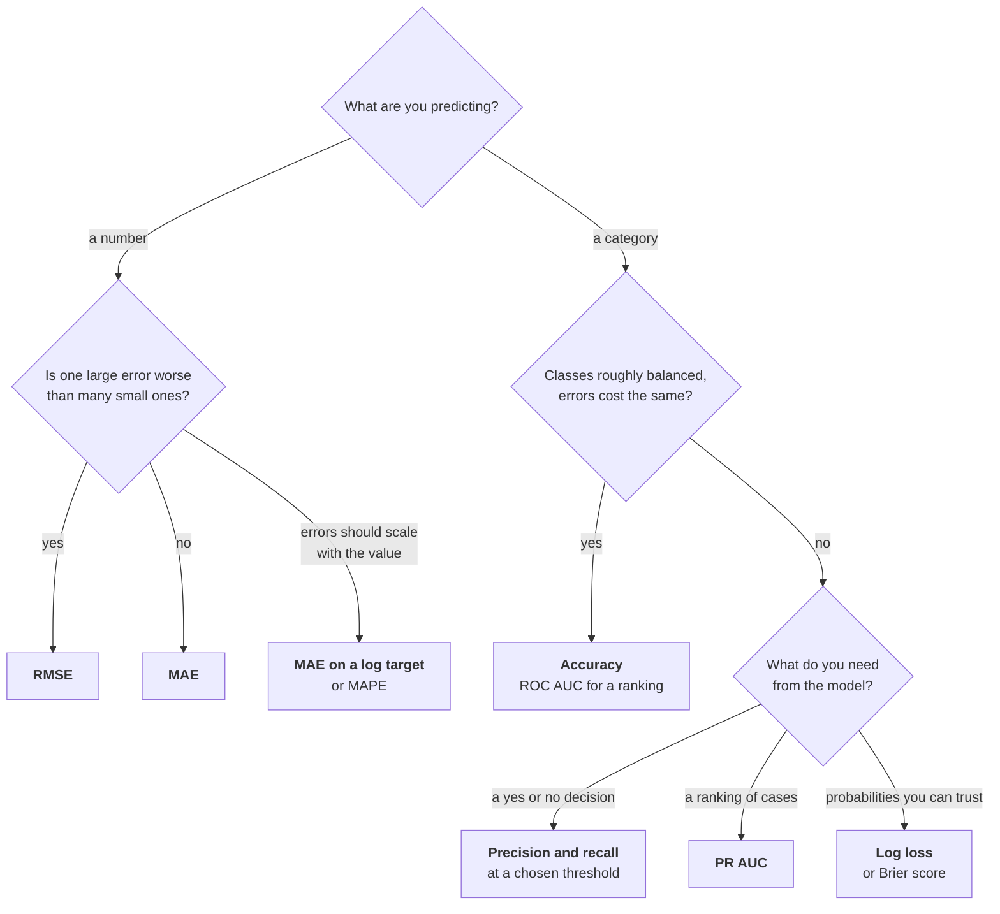

# Choosing a Metric

!!! abstract "At a glance"
    **You need this in:** Week 04 (evaluation), Week 09 (model selection), and every project, which asks you to state your metric and why
    **Estimated time:** 30 minutes
    **Read first:** sections 5 and 6 of [probability and statistics](probability-statistics.md), on precision, recall, and base rates

A metric is a statement about what being wrong costs. Choose it before you train anything, because the metric decides what "better" means, and a model optimised for the wrong one can be excellent at something nobody wanted.

This page is organised around decisions rather than definitions. Each section ends with when to reach for that metric and what it hides from you.

---

## 1. Start from the cost of being wrong

The same model can be good or useless depending on what its errors cost.

| Situation | The costly mistake | So you care about |
|---|---|---|
| Spam filter | A real email lost in spam | Few false positives, so **precision** |
| Fraud flag | A fraudulent payment let through | Few false negatives, so **recall** |
| Apartment price estimate | Being far off on any single listing | Size of errors in euros, so **MAE** or **RMSE** |

Before writing model code, finish this sentence for your project: *"The worst thing this model can do is ..."* The answer usually picks the metric for you.

## 2. The decision map



A starting point, not a rule. Most projects report two metrics: one that decides between models, and one that a human can read.

---

## Regression

## 3. MAE versus RMSE

\[
\text{MAE} = \frac{1}{n}\sum_i \lvert y_i - \hat{y}_i \rvert
\qquad
\text{RMSE} = \sqrt{\frac{1}{n}\sum_i (y_i - \hat{y}_i)^2}
\]

Both are in the units of the target, so both read naturally: *"on average we are 12,000 euros off."* The difference is how they treat a large miss.


*Nine small errors and one large one. MAE roughly doubles. RMSE more than quadruples, because squaring lets the single miss dominate.*

**Use RMSE** when a large error is disproportionately bad, for example when a very wrong price estimate loses a sale entirely. **Use MAE** when every euro of error costs about the same, or when your data has outliers you do not want the model contorting itself around.

RMSE is always at least as large as MAE. A big gap between them tells you a few predictions are very wrong, which is worth investigating before you report either.

## 4. R², and why it misleads

\[
R^2 = 1 - \frac{\sum_i (y_i - \hat{y}_i)^2}{\sum_i (y_i - \bar{y})^2}
\]

The fraction of the target's variance the model explains. 1 is perfect, 0 means no better than always predicting the mean, and it goes **negative** when the model is worse than that.

Three traps:

- **It depends on how spread out the target is.** The same absolute errors give a higher R² on a dataset with a wider range of prices. It is not comparable across datasets.
- **It says nothing about units.** An R² of 0.85 does not tell anyone whether the model is off by a hundred euros or a hundred thousand.
- **It rewards explaining variance, not being useful.** A model can have a respectable R² and still be too inaccurate for any real decision.

Report it if you like, but never alone. Always put MAE or RMSE next to it.

## 5. Relative error

Being 20,000 euros out on a 60,000 flat is a disaster. On a 600,000 villa it is a rounding error. When errors should be judged relative to the value, you have two options.

**MAPE**, mean absolute percentage error, is intuitive but breaks near zero: a small true value makes the percentage explode. Fine for prices, useless for anything that can be zero.

**Train on the log of the target** and compute MAE there. An error in log space is roughly a percentage error, and it avoids MAPE's problem. The [probability page](probability-statistics.md) shows the transform in code.

---

## Classification

## 6. Accuracy, and when it is fine

Accuracy is the fraction of predictions that were right. It is fine in exactly one situation: the classes are roughly balanced **and** both kinds of mistake cost about the same.

Outside that, it misleads. On data where 2% of cases are positive, a model that always says *no* scores 98% accuracy and catches nothing. If you report accuracy on imbalanced data, report the majority-class baseline next to it so the reader can see how little it means.

## 7. Precision, recall, and F1

Precision asks *of the cases I flagged, how many were real*. Recall asks *of the real cases, how many did I flag*. The [probability page](probability-statistics.md) explains them as conditional probabilities, which is the clearest way to keep them apart.

They pull against each other, so you choose which to favour based on section 1:

- **Favour precision** when acting on a false alarm is expensive.
- **Favour recall** when missing a real case is expensive.

**F1** is their harmonic mean. It is useful as one number for comparing models, but it hides the trade-off rather than resolving it, and it assumes both errors cost the same, which is rarely true. If you know one error is worse, **F-beta** lets you lean deliberately: F2 weights recall twice as heavily as precision, F0.5 does the reverse.

```python
from sklearn.metrics import fbeta_score

fbeta_score(y_test, y_pred, beta=2)    # recall matters twice as much
```

## 8. The threshold is a separate decision

The idea students most often miss. A classifier does not output *yes* or *no*. It outputs a score between 0 and 1, and something converts that score into a decision by comparing it with a threshold. The default is 0.5, and nothing about that number is special.


*One trained model. Every threshold gives a different precision and recall. Choosing where to sit on these curves is a business decision, and it happens after training.*

```python
scores = model.predict_proba(X_val)[:, 1]
y_pred = (scores >= 0.3).astype(int)    # lower threshold, higher recall
```

!!! warning "Choose the threshold on validation data"
    Pick it using a validation set or cross-validation, never the test set. Tuning a threshold on test data is tuning on test data, with all the optimism that brings.

Two consequences worth remembering. Precision, recall, and F1 all depend on the threshold, so they describe a model *at a setting*, not the model itself. And a model that looks poor at 0.5 may be excellent at 0.2.

## 9. ROC AUC versus PR AUC

Both summarise performance across every threshold at once, which is exactly why they are useful for comparing models before you have chosen one.

**ROC AUC** is the probability that a randomly chosen positive gets a higher score than a randomly chosen negative. It reads well and is stable, and it is misleading when positives are rare.

**PR AUC**, reported by scikit-learn as *average precision*, is built from precision and recall instead. Because precision is sensitive to the flood of negatives, it tells the truth when the positive class is small.


*One model, one dataset with 2% positives. The ROC curve suggests an excellent classifier. The PR curve shows that to catch most of the positives you accept mostly false alarms.*

The ROC curve's x-axis is the false positive rate, a fraction of a very large number of negatives. Thousands of false alarms barely move it. Precision counts them directly.

**Rule:** balanced classes, either is fine. Positives under about 10%, use PR AUC.

## 10. Log loss and the Brier score

Sometimes the probabilities are the product. A risk score, an expected cost, anything where someone will act on *how likely*, not just *which class*.

**Log loss** punishes confident wrong answers severely: predicting 0.99 for something that did not happen costs far more than predicting 0.6. **The Brier score** is the mean squared difference between predicted probability and outcome, gentler and easier to read.

Both reward calibration, which the [probability page](probability-statistics.md) covers. A model can rank cases perfectly and still have poor log loss if its probabilities are overconfident.

---

## 11. Every metric needs a baseline next to it

A number on its own means nothing. *"MAE of 14,000"* is excellent if a naive guess is off by 60,000, and poor if it is off by 16,000. Always report what doing nothing would score.

| Metric | What a no-skill model scores |
|---|---|
| MAE | Always predicting the median |
| RMSE | Always predicting the mean, which gives the standard deviation of the target |
| R² | 0, by definition, for always predicting the mean |
| Accuracy | The share of the most common class |
| ROC AUC | 0.5 |
| **PR AUC** | **The share of positives**, so 0.02 if 2% of cases are positive |
| Log loss | \(-\bigl[p \ln p + (1-p)\ln(1-p)\bigr]\), with \(p\) the share of positives |
| Brier score | \(p(1 - p)\) |

The PR AUC row is the one almost nobody knows. A PR AUC of 0.30 is poor on balanced data and very good when positives are 2%.

```python
from sklearn.dummy import DummyClassifier, DummyRegressor

DummyRegressor(strategy="median")            # baseline for MAE
DummyClassifier(strategy="most_frequent")    # baseline for accuracy
DummyClassifier(strategy="prior")            # baseline for probability metrics
```

---

## Quick reference

| Metric | Use when | Hides | `scoring=` |
|---|---|---|---|
| MAE | Every unit of error costs the same | Whether a few predictions are very wrong | `"neg_mean_absolute_error"` |
| RMSE | Large errors are disproportionately bad | Typical error, when a few outliers dominate | `"neg_root_mean_squared_error"` |
| R² | Alongside MAE or RMSE, never alone | Units, and usefulness | `"r2"` |
| MAPE | Errors should be relative, target never near zero | Everything, near zero | `"neg_mean_absolute_percentage_error"` |
| Accuracy | Balanced classes, equal costs | Everything, under imbalance | `"accuracy"` |
| Balanced accuracy | Imbalanced, and you want one readable number | Which class is failing | `"balanced_accuracy"` |
| Precision | False alarms are costly | Missed cases | `"precision"` |
| Recall | Missed cases are costly | False alarms | `"recall"` |
| F1 | One number to compare models, costs roughly equal | The trade-off itself | `"f1"` |
| ROC AUC | Ranking, balanced classes | Poor precision when positives are rare | `"roc_auc"` |
| PR AUC | Ranking, rare positives | Behaviour at any specific threshold | `"average_precision"` |
| Log loss | The probabilities are the product | Readability | `"neg_log_loss"` |
| Brier score | Probabilities, in a readable form | Rare-class performance | `"neg_brier_score"` |

!!! note "Why the `neg_` prefix"
    scikit-learn always maximises a score. Error metrics are better when smaller, so it reports them negated. A `neg_mean_absolute_error` of −12.4 means an MAE of 12.4. Flip the sign before you report it.

## Resources

- [scikit-learn, metrics and scoring](https://scikit-learn.org/stable/modules/model_evaluation.html). The complete list, with the scoring strings.
- [Saito and Rehmsmeier, The Precision-Recall Plot Is More Informative than the ROC Plot When Evaluating Binary Classifiers on Imbalanced Datasets](https://journals.plos.org/plosone/article?id=10.1371/journal.pone.0118432). The paper behind section 9, and short.
- [Google, Machine Learning Crash Course: classification](https://developers.google.com/machine-learning/crash-course/classification). Clear interactive treatment of thresholds and ROC.

---

**Next in this section:** [scikit-learn cheatsheet](sklearn-cheatsheet.md), where every metric on this page is one argument away.
